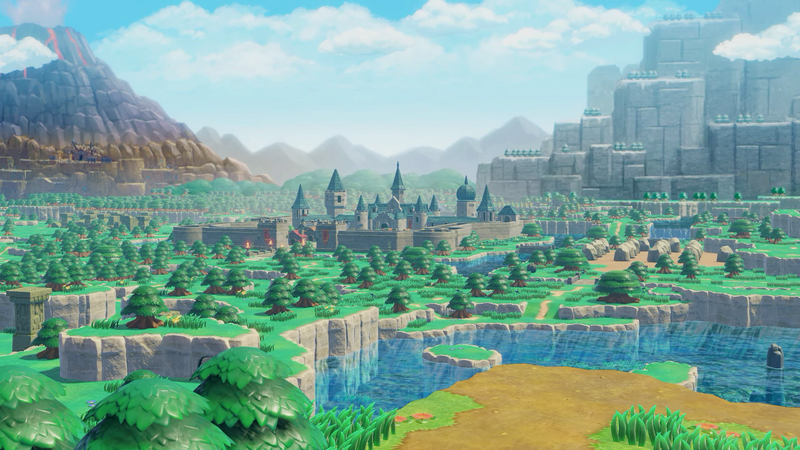
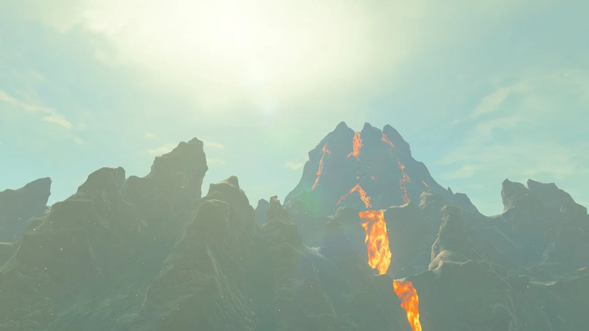
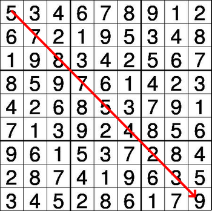
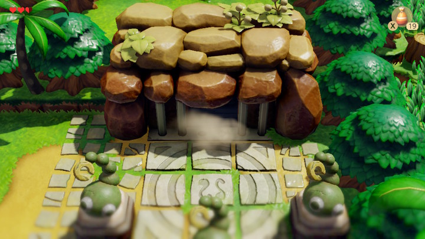
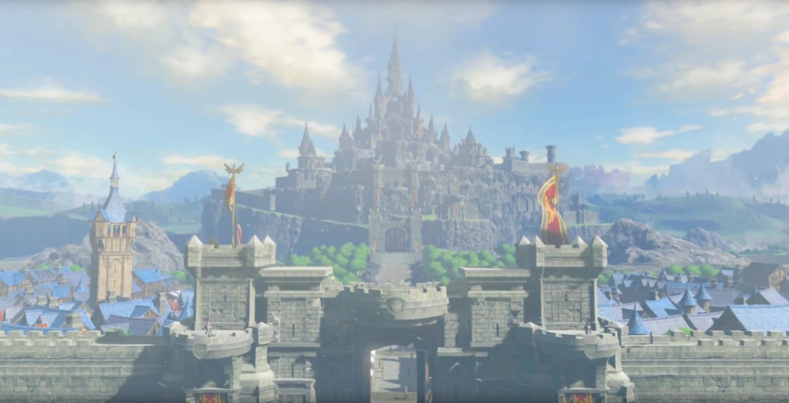

## I. Introduction

Lorsqu'une ancienne malédiction fragmente la Triforce en neuf sceaux cachés, les adeptes de Ganondorf dissimulent chaque fragment dans une grille scellée.
À travers les contrées d'Hyrule, de vieux sanctuaires, ruines et tours oubliées renferment des Sudoku mystiques conçus pour égarer les intrus et tester la sagesse des courageux.

Vous devrez aider Link à percer ces énigmes le plus rapidement possible. À mesure que chaque grille cède, la vérité derrière la malédiction se précise.



### Lancer le projet

Pour démarrer le projet, placez-vous à la racine du dépôt puis exécutez la commande suivante :

```bash
python3 hyrule.py --map sudoku/<map>.txt
```

!pagebreak

## II. La Montagne de la Mort

Dominant les nuages, la Montagne de la Mort est un massif de basalte noir, balayé d'éclairs et marqué par les cicatrices d'une magie ancienne. Les anciens disent que son ombre recouvre un tiers du monde.



!pagebreak

### 1. Permiere epreuve

Link a déjà commencé la récupération des Triforces. Il ne te reste plus que l'algorithme à concevoir.

La première épreuve est un Sudoku mystique gravé sur la paroi d'une salle circulaire. Résoudre la grille permet de récupérer la Triforce du **Courage**.
En cas d'échecs répétés, de nombreux Hinox se réveilleront. Avance avec méthode et prudence.

Le code est constitué des neuf chiffres situés sur la diagonale de la grille, lus dans l'ordre, de la case en haut à gauche jusqu'à la case en bas à droite.



!pagebreak

## III. Caverne Flagello

Perchée sous un réseau de racines et de roches polies, la Caverne Flagello s'étend sur plus de 2 km. Les parois sont couvertes de mousse et de lierre. On y distingue d'anciennes gravures qui semblent indiquer quelque chose.

La seconde épreuve est un Sudoku ténébreux gravé dans une langue ancienne. Résoudre la grille permet de récupérer la Triforce de la **Sagesse**.

Les erreurs réveilleront des Gigantehl qui viendront vous chasser hors de la caverne.



!pagebreak

## IV. Château d'Hyrule

Niché au centre d'Hyrule, le château s'élève comme un phare de pierre et de mémoire. Il compte 30 sentinelles postées sur les remparts, chargées d'assurer la sécurité du château.
Ses tours crénelées percent le ciel, ses douves murmurent des légendes, et ses salles renferment des siècles de décisions, de trahisons et de serments.
Il figure parmi les plus grands châteaux, avec 427 salles répertoriées dans les registres royaux.

La troisième et dernière épreuve est la plus complexe. Vous devrez survivre à l'attaque d'un cobra déterminé à vous tuer et résister à la destruction de vos outils. Résoudre cette grille permet de récupérer la Triforce de la **Force**.



!pagebreak

## V. Conclusion

Après des épreuves ardues, vous avez rassemblé les neuf sceaux et reconstitué la Triforce dans ses trois aspects : **Courage**, **Sagesse** et **Force**.

La malédiction est brisée et Hyrule respire à nouveau. Les habitants sont libérés et la paix revient sur les terres.

Les sanctuaires se referment, les ruines se calment, et la nature reprend ses droits.
En héros discret, vous avez sauvé le peuple et scellé un nouvel équilibre pour l'avenir.
Que les chants d'hymne murmurent votre nom à travers les âges.


