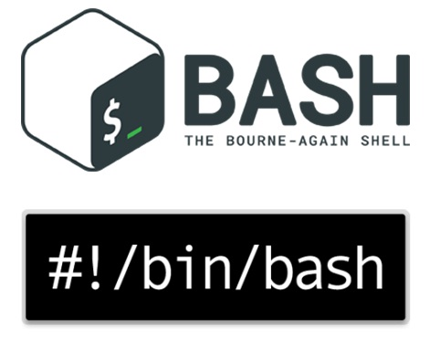
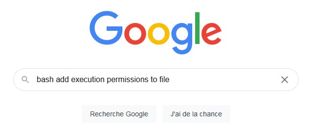
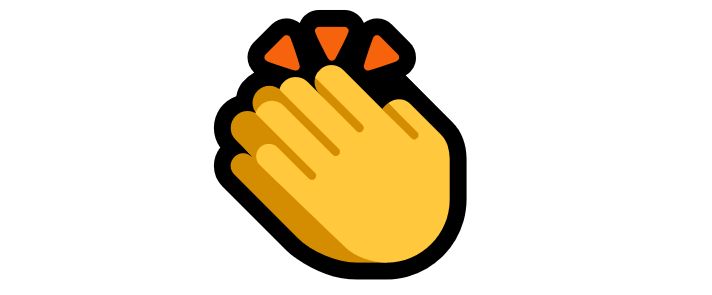
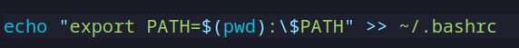
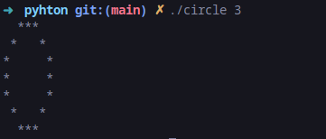
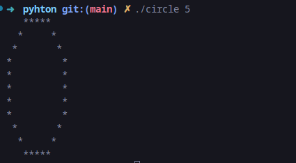
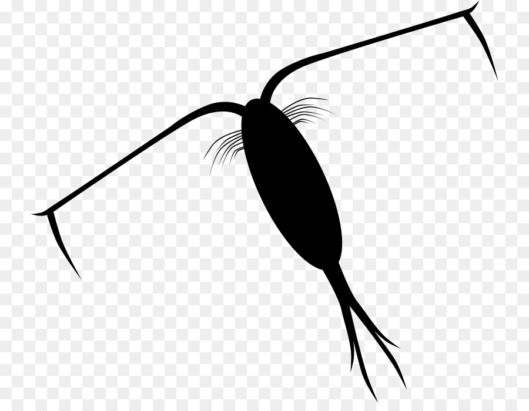

Il faisait chaud, les vacances approchaient, les bars et restaurants ouvraient à nouveau la période la plus dure de l’année est maintenant derrière nous. Tu l’as trouvé, tu as patienté en faisant la queue tu as même dû lâcher un gros billet pour rentrer mais il reste une dernière chose à faire avant d’entrer en Piscine,<u>
passer par le Pédiluve</u>.


La municipalité d’Epitech a construit une piscine de qualité dans laquelle tu vas pouvoir faire du sale, mais remettons les choses à plat :
Avant de se jeter en bombe, il faut s’assurer que l’on a bien les pieds propres.Ce serait bête d’attirer les microbes et les moustiques.

Aujourd’hui nous allons apprendre à utiliser un shell Linux et à développer des algorithmes complexes en Python car il est très important de savoir faire les 2 pour bien gérer une piscine.

Tu ne vois pas de rapport ? Et bien crois moi tu vas le voir arriver de très loin.

!pagebreak

## I. Pied Droit : Bash



Bash pour Bourne-Again Shell est un interpréteur de commandes très connu et très utilisé sur Linux. Même si aujourd’hui certains de ces petits frères tels que ZSH ou encore Fish tendent à le remplacer, il a marqué l’histoire car son arrivée a standardisé la façon de communiquer avec son environnement Linux.

On tape une commande et Bash va exécuter pour nous le logiciel correspondant
(Tu comprendras tout ça une fois dans le grand bain)

```
$> echo "Hello World"
Hello world
```

Tu seras invité à chercher par toi même les outils et commandes qui te serviront à bien laver ton pied droit. Ceci dit nous allons quand même exceptionnellement t’en indiquer quelques uns et encore on ne sera pas complet.

**Google est ton ami !**


!pagebreak

Ces commandes sont en réalité des programmes eux aussi. Donc faire ça :

```
$> ls
fichier-lol dossier-omg/
```

Revient à faire ça :

```
$> /bin/./ls
fichier-lol dossier-omg/
```
Sans vraiment rentrer dans les détails (afin que tu le fasse par toi-même), il faut comprendre que toutes les commandes basiques sont des programmes placés dans des dossiers spécifiques où Bash ira chercher en priorité ce que tu lui demande de faire.

Les scripts que tu t’apprête à coder ne seront pas (encore) dans ces dossiers spécifiques. Par conséquent tu devra mettre ”./” (un point et un slash) devant le chemin vers ton programme :

```
$> ls
discord fortnite valorant
$> ./discord
```

Normalement tout programme (fichier ayant les droits d’exécution) trouvé via ”ls” est censé s’afficher en vert

**Si tu es dépourvu de couleur, tu peux te repérer en faisant ”ls -l”. Il faut alors que tu vérifies le 4e caractère au début de la ligne de ton fichier soit bien ’x’ et non pas ’-’.**

!pagebreak

```
$> ls -l
total 3
-rwxr-xr-x 1 toi toi 33156 Jun 29 00:38 fortnite
-rwxr-xr-x 1 toi toi 137 Jun 29 00:38 discord
-rw-r–r– 1 toi toi 7158 Jun 28 21:54 valorant
```
Du coup, on peut constater que ”valorant” risque de ne pas s’exécuter. Pour régler ce problème on doit lui donner les droits d’exécution !

**Et si on demandait à Google comment faire ça ?**



Il y a une dernière chose à savoir : lorsque qu’un programme est exécuté, il peut être amené à nous afficher des informations directement sur le terminal mais à la fin de son exécution il nous renvoie systématiquement un statut sous la forme d’un nombre entier positif. C’est ce nombre qui nous permet de vérifier qu’un programme a été exécuté avec succès (si son statut est égal à 0).

!pagebreak

### a. getStatus

Lors de ton passage par le pédiluve, on va devoir vérifier l’état des pieds de tous les aventuriers. On va donc créer de quoi effectuer ces vérifications.

On va procéder de la manière suivante :

On récupère le statut de la dernière commande. Si la commande s’est exécutée avec succès alors on affiche ”Les pieds sont propres !” S’il y a eu un problème on affiche ”T’as de ces ieps chacal...”

Exemple :

```
$> ls
ticket
$> ./getStatus $ ?
Les pieds sont propres !
```

Ou encore :

```
$> ls dossier-qui-nexiste-pas
ls : cannot access ’dossier-qui-nexiste-pas’ : No such file or
directory
$> ./getStatus $ ?
T’as de ces ieps chacal...
```
**T’as déjà entendu parler des Shebangs ?**

>N’oublie pas de régulièrement pousser ton travail sur Git ! De mauvaises surprises peuvent t’attendre et causer ta noyade sinon

!pagebreak

### b. countCharo

Les pieds des aventuries semblent aussi propres que le crâne de Mr Propre. On dirait que ton outil fonctionne bien. Alors on va l’améliorer en règlant un autre problème !

Dans notre piscine se rendent aussi certaines jolies demoiselles qui viennent pricipalement d’ISEG City. Et nous avons pensé à elles en prenant soin de leur mettre à disposition d’autres vestiaires afin de respecter leur intimité. Or, on peut régulièrement apercevoir des aventuriers d’Epitech entrer et sortir dans les mauvais vestiaires.

On les appelle les <u>Charos</u>

Afin de les arrêter, il va falloir scanner les vestiaires ”Epitech” et ”ISEG” et vérifier qui s’y trouve.

- Toutes les personnes dont le prénom se termine par la lettre ’a’ sont des aventuriers d’Epitech
- Ceux dont le prénom se termine par la lettre ’z’ sont des jolies demoiselles d’ISEG City
-  Ceux ne correspondant à aucun des 2 critères sont des instrus et il faut appeler le videur pour les chasser.

Il faut que tu compte le nombre d’aventuriers d’Epitech présents dans le mauvais vestiaire et que tu renvoie ce nombre en tant que statut.

Dans ce premier exemple, le statut doit être égal à 0

```
$> ls
Epitech/ ISEG/
$> ls Epitech/
Grisha Koba Luca
$> ls ISEG/
Delyaz Mariz Nellyz
$> ./countCharo
```
!pagebreak

Dans ce deuxième exemple, le statut doit être égal à 2 (les pauvres demoiselles).

```
$> ls Epitech/ ISEG/
Epitech/ : Grisha
ISEG/ : Delyaz Mariz Nellyz Koba Luca
$> ./countCharo
```

Dans ce troisième exemple, le statut doit être égal à 1 et certains participants doivent être renvoyés

```
$> ls -R
Epitech : Grisha Luca Mehdi
ISEG : Delyaz Mariz Nellyz Koba Jose
$> ./countCharo
$> ls -R
Epitech : Grisha Luca
ISEG : Delyaz Mariz Nellyz Koba
```

!pagebreak

### c. cloackroomCleaner

Ce problème n’a pas été simple à régler mais tu y es partiellement parvenu bravo ! Il est temps de finir le travail en beauté en redirigeant tous nos clients dans les bons vestiaires, toujours en renvoyant les intrus.

Le statut devra être 0 dorénavant.

Exemple :

```
$> ls -R
Epitech : Grisha Luca
ISEG : Delyaz Mariz Nellyz Koba
$> ./cloackroomCleaner
$> ls -R
Epitech : Grisha Luca Koba
ISEG : Delyaz Mariz Nellyz
```

Ou encore, avec un intrus en supplément :

```
$> ls -R
Epitech : Delyaz Mariz Nellyz Giroud
ISEG : Grisha Luca Koba
$> ./cloackroomCleaner
$> ls -R
Epitech : Grisha Luca Koba
ISEG : Delyaz Mariz Nellyz
```
!pagebreak



Félicitations ! Tu as réussi à faire régner l’ordre dans notre Piscine le tout en nettoyant ton pied droit. Il nous reste encore du chemin à faire mais cette fois-ci avec le 2e pied.

### d. Bonus

Juste avant de passer à la suite je te propose de faire de tes programmes de vraies commandes. Si tu te rappelle encore de ce que je te disais au début par rapport aux programmes tu dois sûrement te rappeler que les commandes sont trouvées si elles sont présentes dans des dossiers spécifiques. Nous allons donc rajouter parmis les dossiers spécifiques le dossier dans lequel se situe tes scripts. Ainsi tes commandes pourront être lancées depuis n’importe où.

On va ajouter ton dossier dans les dossiers prioritaires puis redémarrer ton shell



```
$>cd && source .bashrc
```
!pagebreak

## II. Pied Gauche : Python

Je vois que tu es un dur qui n’a pas peur d’affronter les problèmes. La complexité va monter d’un cran mais je te rassure tes moyens aussi.

Maintenant que tu maîtrise Bash je te propose de passer à Python. Avant même de commencer à coder je dois te parler des paquets :

Il s’agit de logiciels que tu peux installer depuis des répertoires distants à l’aide de Gestionnaires de Paquets. La distribution Linux sur laquelle tu te situe en est forcément pourvue d’une. Nous partons du principe que tu es sur Ubuntu et dans ce cas le gestionnaire de paquets est ”apt”.

Tu dois te demander pourquoi je te parle de ça ? C’est parce que sur Linux (du moins sur certaines de ses distributions) tu commences avec très peu de paquets et tu dois tout installer toi-même, y compris Python par exemple.

Si tu es sur un pc cobra, alors Python est normalement déjà installé et ça peut se vérifier :

```
$> python3 --version
```

Si tu ne possède pas Python alors tu peut l’installer via ton gestionnaire de paquets. Commence par mettre à jour tes paquets et installe python3

Ubuntu :
```
$> sudo apt update
$> sudo apt upgrade
$> sudo apt install python3
```

Endeavour OS :
```
yay -S python3
```
!pagebreak

### a.Pédiluve Circulaire

Les pédiluves tels qu’ont les connait ont généralement une forme carrée. Mais nous, on va casser les codes ! L’idéal serait d’avoir une forme plutôt circulaire comme celle-ci.


Mais évidemment, maintenant qu’on sait que l’informatique est dans tes veines, on va attendre une chose supplémentaire de toi, et pas des moindres :

# La rigeur !

C’est à dire qu’on va attendre de toi que le produit fonctionne exactement comme on le souhaite. Au caractère près, aucun détail ne doit t’échapper !

Mais nous ne sommes par barbares pour autant, nous te fournissons un exécutable exemple dont tu dois méticuleusement copier le comportement.



!pagebreak



Il sera important de tester le binaire fournis afin de comprendre la logique.

>La fonction suivante te sera demandée !

```
$>def printcircle(radius) :
```

Cette fonction devra calculer et afficher chaque partie du cercle.

>N’oubliez surtout pas d’inclure la librairie de math !

!pagebreak

### b. La pousse des algues

Comme on l’a vu plus tôt, tous les pieds sont propres en sortant du pédiluve, mais cela signifie en contre-partie que tous leurs microbes sont restés dans le pédiluve. Or tu n’es peut-être pas sans savoir que dans la nature il existe des micro-organismes qui se délectent de ces microbes : Il s’agit des Zooplanctons.



Dans la mer leur existence est primordiale pour la chaîne alimentaire. Mais dans notre piscine, ils présentent une gêne car ils peuvent favoriser l’apparition d’algues, et c’est pas ce que l’on souhaite (bien que les poiscailles soient nos amis). Le but ne va pas être de les éliminer mais de prévoir leur croissance qui est assez particulière.


Comme on peut le voir ci-dessus leur forme est fait d’un motif qui est imbriqué dans ce même motif qui est lui même imbriqué dans ce même motif et ce à l’infini.

!pagebreak

On appelle ça :
# Une fractale !


Le but va être de reproduire graphiquement cette forme fractale et d’observer l’évolution de nos algues. Là aussi tes moyens vont être améliorés car tu vas pouvoir utiliser Turtle

**Turtle** est une librairie Python pré-installée qui permet aux utilisateurs de dessiner
différentes formes sur une toile blanche.

```
$>
import turtle
pen = turtle.Turtle()
screen = turtle.Screen()
t.forward(50)
t.up()
t.forward(50)
t.down()
t.forward(50)
```

>Ce code est un exemple très simpliste, il te montre seulement quelques fonctions de turtle. En plus, on a même pas le temps de voir le résultat...

!pagebreak

>La fonction suivante te sera demandée !

```
$>def fractal(time) :
```

Cette fonction devra calculer et afficher chaque branche de l’algue.

Par exemple :
```
$>./fractal 8
```

Va donner ça :


>Déjà entendu parler d’une mainloop ?

!pagebreak

## III. Félicitations

Tu viens de passer ce pédiluve avec succès. Prépare le tuba, les brassards et le bonnet de bain , la piscine t’attends désormais !


