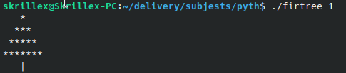
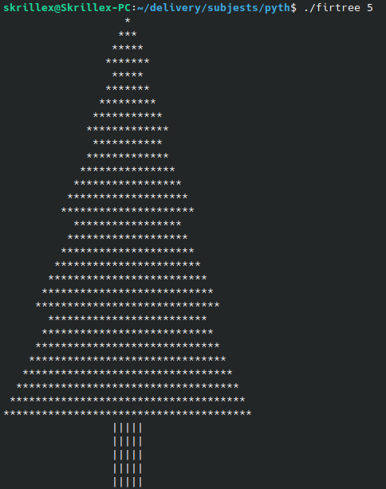

The goal of the project is to realize a tree with different levels given in parameters.

It will be important to separate your functions logically in order to complete this program.

It will be required that your score contains the following functions:

<code>def trunk(size):</code>
This function should be used to calculate and display the trunk of the tree.

<code>def leaves():</code>
This function allows the calculation and display of all the leaves!

**Please make sure that it is recalled several times !
