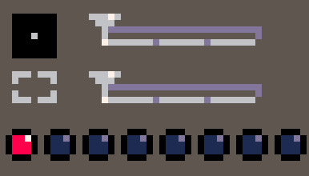

### I - Découverte

#### INTRODUCTION

Du haut d'un royaume enneigé, un jeune garçon rêveur et curieux, Tony, adorait passer ses journées à explorer les forêts et les montagnes environnantes. Un jour, il entendit un bruit étrange provenant des arbres et découvrit une petite fée en train de pleurer. La fée lui expliqua qu’elle avait perdu sa baguette magique et qu’elle ne pouvait plus rentrer chez elle. Tony décida de l’aider. Après un long périple, il se retrouva devant une grotte et aperçu la baguette magique. Il ne lui resta plus qu’une chose à faire, traverser la grotte gelée...

L’ objectif de cet atelier est la réalisation d’un plateformer en Lua en utilisant le logiciel Pico8. Pour cela, vous allez devoir vous familiariser avec tous les outils disponibles sur le logiciel et ainsi réaliser :

- Vos propres sprites et assets 

- Créer votre environnement de jeux
- Ajouter des features annexes

!pagebreak

#### Installation

Dézippez le fichier source, Pico8 devrait être fonctionnel immédiatement !

#### Découverte Pico-8

Ouvrez Pico-8 et écrivez la commande `install_games` , ensuite rendez vous dans le dossier fraîchement crée avec la commande `cd games` , puis `load celeste p8 plus`, ensuite libre à vous d’explorer ! Vous pouvez appuyer sur echap afin d’avoir un aperçu du code et `run` pour lancer le jeux.

Pour aller plus loin, vous pouvez reprendre les commandes précédentes en remplaçant game par demo.

Une fois vos repère pris, appuyez sur echap et écrivez sur la console `reboot` pour commencer à créer votre propre jeu.

> :info Pensez à régulièrement sauvegarder votre travail à l’aide de save (ctrl + s)

> :info Pour créer votre jeu pico: `save <nom_jeu>` puis `load <nom_jeu>.p8`

!pagebreak

### II - Passez à l'action

#### DESIGN DE VOTRE PERSONNAGE

Pour dessiner votre personnage, vous devez vous rendre sur le deuxième onglet de la console.

Ensuite, laissez libre cours à votre imagination ! Pour animer votre sprite vous aurez besoin de :

- 2 sprites où votre personnage est statique
- 4 sprites où votre personnage se déplace
- 1 sprite de glissement
- 1 sprite où le personnage chute
- 1 sprite de saut

Si le dessin n’est pas votre truc, vous pouvez importer des sprites avec la commande`import filename.png`

#### CREATION DE LA MAP

Pour créer votre map, dessiner des sprites sur l’onglet deux, puis appuyez sur le troisième onglet de la console et commencer à créer !

Durant le processus de création, vous aurez besoin des collisions. Pour cela, vous utiliserez les flags.

 

Un flag est représenté par un point de couleur.

Par exemple, on peut dire qu’un mur aura le flag 0 (rouge) pour activer la collision avec ce mur.

!pagebreak

#### LES FONCTIONS INDISPENSABLES

- **_init():** Permet de déclarer des variables globales dès le début du programme

```lua
--variables

function _init()
  player={
    sp=0,
    x=10,
    y=10,
    w=8,
    h=8,
    flp=false,
    dx=0,
    dy=0,
    max_dx=2,
    max_dy=3,
    acc=0.5,
    boost=4,
    anim=0,
    running=false,
    jumping=false,
    falling=false,
    sliding=false,
    landed=false
  }

  gravity=0.3
  friction=0.85

  --simple camera
  cam_x=0

  --map limits
  map_start=0
  map_end=1024
end
```

!pagebreak

- **_update():** Met à jour les infos de l’utilisateur

```lua
function _update()
  player_update()
  player_animate()

  --simple camera
  cam_x=player.x-64+(player.w/2)
  if cam_x<map_start then
     cam_x=map_start
  end
  if cam_x>map_end-128 then
     cam_x=map_end-128
  end
  camera(cam_x,0)
end
```

!pagebreak

- **_draw():** Met à jour les images à l’écran

``` lua
function _draw()
  cls()
  map(0,0)
  spr(player.sp,player.x,player.y,1,1,player.flp)
end
```

!pagebreak

#### LES DÉPLACEMENTS

Pour déplacer votre personnage, vous aurez besoin de capturer les saisies du clavier. Pour cela, vous utiliserez la fonction `BTN` et la direction souhaitée. Les directions sont représentée par les chiffres 1, 2, 3 et 4, mais également par →(shift + R) pour la droite (**R** pour right, **L** pour left, **U** pour up, **D** pour down).

#### LES COLLISIONS

Pour vérifier une collision, nous utiliserons les fonctions `fget` & `mget`.

- **fget()**: fonction qui prend un numéro de sprite et un flag, puis compare les flags sur ce sprite, avec le flag que nous cherchons (ie: 0)
- **mget()**: fonction qui prend les coordonnées de la carte (x, y) et trouve l’index du sprite qui se trouve à cet emplacement sur la carte.

```lua
if fget(mget(x1,y1), flag)
or fget(mget(x1,y2), flag)
or fget(mget(x2,y1), flag)
or fget(mget(x2,y2), flag) then
    return true
else
    return false
end
```

!pagebreak

#### III - Pour aller plus loin

Tout d’abord : bravo !

Maintenant, libre à toi de modifier le jeu selon tes désirs ! Tu as normalement dû apprendre certaines choses, et tu peux modifier à ta guise des parties du programme ou ajouter de nouvelles choses facilement comme du texte, de nouveaux projectiles, etc… Voici quelques exemples d’ajouts sympathiques ! :

- Faire un menu
- De la musique et des sons.
- Un score et un écran de Game Over.
- Créer des niveaux
- De nouveaux ennemis ou personnages jouables.

N’hésite surtout pas à demander de l’aide à un Cobra (ceux qui mordent pas **groumph** miom) si tu as du mal à appliquer certaines de tes idées !
