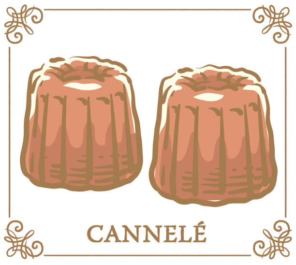
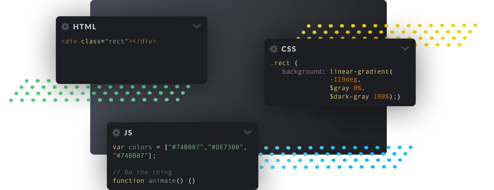
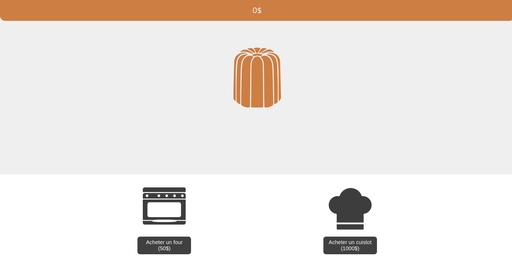

## I. Introduction
Chef Pesos, président d’une grande société californienne, passe ses vacances en France dans la ville de Bordeaux. En pleine exploration culinaire, il goûte à un cannelé si bon qu’il en devint amoureux. Il décide alors d’abandonner son poste afin de se consacrer entièrement à sa nouvelle passion pour ce moelleux dessert et ce, en participant à la création de la nouvelle pâtisserie de la ville !



Il obtient les clés de sa nouvelle boutique en proposant son projet à son ami Gippé, jeune cadre dynamique, pour qui la question est vite répondue. En revanche, le local qu’ils ont obtenu n’a pas vraiment fière allure. C’est alors que les associés font appel à vos services de développeur pour
l’aider à concevoir la pâtisserie des rêves du Chef.

## II. Consignes
Découvrons ensemble votre mission en commençant par parler un peu de développement Web.

Votre objectif est de réaliser un site internet !

Un navigateur ne reconnaît que 3 langages:

- **Le HTML:** Un langage de balisage qui permettra de placer les éléments visibles sur la page.
- **Le CSS:** Un langage de stylisation faisant prendre forme votre page HTML
- **Le JS:** Un langage de scripting permettant de créer des intéractions sur votre page.



Pour le sujet d'aujourd'hui **nous vous proposons une base de CSS.** Cela vous épargne donc de vous soucier du style de la page pour se concentrer sur l'aspect fonctionnel. Il est assez courant de retrouver, dans le développement web, des librairies CSS proposant ce genre de service.

>:info !icon:info-circle Si toutefois vous vous sentez l'âme d'un artiste, vous êtes totalement libre de faire votre propre style pour la page.

### Revenons en au projet...
Votre mission est de réaliser un mini-jeu type "clicker" autour de l'univers du cannelé.

Vous avez à votre disposition une petite base pour commencer : un squelette HTML vide.

**Le HTML** comme dit précédemment est un langage de **balisage**, tout est structuré avec des balises, les unes dans les autres.

Un document HTML, c'est tout d'abord une balise "html":

```html
<html>
</html>
``` 

C'est la balise parente du document. Dans cette dernière on vient toujours ajouter deux balises : la tête et le corps.

```html
<html>
	<head>
	</head>
	<body>
	</body>
</html>
```

La tête servira à configurer notre page et le corps sera le contenu en lui même.

```html
<html>
	<head>
		<title>Mon super site !</title>
	</head>
	<body>
		Coucou tout le monde !
	</body>
</html>
```

La balise "title" sert à indiquer le nom qui sera affiché sur l'onglet du navigateur tandis que le texte "Coucou tout le monde !" sera visible sur la page.

Bon alors si vous avez bien compris tout ça...

## Construisons notre page

Notre page finale devrait ressembler à ce qui suit:

(Je rappelle que les fichiers concernant le style de la page sont déjà fournis, nous nous contenterons de placer les éléments...)

L'élément de base en HTML est la **"division"** (ou "\<div>"). C'est simplement une boite vide qui peut contenir d'autres éléments ou juste exister seule.

Il existe aussi d'autres éléments plus spécifiques comme le **"paragraphe"** ("\<p>") qui sert a contenir du texte.

#### Reprenons notre page depuis le début...

On voit dans un premier temps l'argent du joueur tout en haut que l'on va représenter à l'aide d'un paragraphe ayant pour identifiant unique "score".

Certains sont perdus ?

Je reprend, pour déclarer un paragraphe en HTML on ouvre et ferme une balise `<p>` dans notre `<body>`: 

```html
<p></p>
```

Pour distinguer ce paragraphe des autres de la page on peut lui donner un identifiant unique ("id") en l'ajoutant simplement à la balise d'ouverture:
```html
<p id="score"></p>
```

>:info !icon:info-circle L'id est un attribut de l'élément, il en existe d'autres et on les ajoutes toujours dans la balise d'ouverture comme au dessus.

Pour finir, on peut ajouter du texte dans notre paragraphe:
```html
<p id="score">0$</p>
```

### Pour les prochains éléments, on va aller plus vite !

Sous notre score on doit créer une "\<div>" ayant pour identifiant "cannele". Cette div ne contient rien pour l'instant.

Après avoir fermé la balise précédente, on crée une nouvelle div, ayant pour id "shop", qui contient une div pour chaque amélioration à acheter. Pour l'instant on va créer les divs "four" et "cuistot". 

Chacune des div concernant une amélioration doit contenir une balise "\<button>" avec un texte incitant à l'achat de l'amélioration.

C'est bon c'est fini ! Vous pouvez double-cliquer sur le fichier "index.html" pour afficher le résultat dans votre navigateur.

> Si ça ne marche pas totalement, n'hésitez pas à appeler un cobra !

_Je rappelle que vous n'êtes pas obligés d'utiliser le style fourni. Si vous avez une idée de design en particulier, vous pouvez modifier le fichier `assets/style.css` ou créer le votre..._

## Le jeu
Si vous avez bien suivi, nous avons placé et stylisé nos éléments,  il nous reste le troisième langage de notre triangle du web: le **JavaScript** _(qui permet l'automatisation)_.

Faisons un petit listing de ce que nous devons implémenter:

- Cliquer sur le cannelé permet de le cuisiner, ça rapporte 1\$
- Les boutons acheter un four et acheter un cuistot doivent être fonctionnels

Lors de l'achat d'une amélioration: 

- Si le joueur n'a pas assez d'argent, ne rien faire
- S'il a assez d'argent:
	- Débiter l'argent
	- Ajouter l'effet de l'amélioration\*
	- Augmenter le prix de x1.5

\*Les effets des améliorations sont les suivants:

- Chaque four rapporte un cannelé (donc 1\$) de plus lors de la préparation.
- Les cuistots rapportent automatiquement un cannelé par seconde (2 cuistots en rapportent 2... etc)

> Dans l'idéal, les prix doivent rester entiers. On arrondira les prix s'il y a une virgule.

Pour créer ces fonctionnalités nous allons avoir besoin d'un fichier `script.js` que nous allons créer au même endroit que notre `index.html`:

```
├── assets/
├── index.html
└── script.js
```

Nous devons importer ce script dans la **head** de notre page avec la balise suivante:

```html
<script src="script.js"></script>
```

Dans notre fichier de script nous allons créer des fonctions que nous associerons aux éléments de notre page.

### Exemple:

script.js:
```js
// Variables globales, accessibles de partout dans le code

// Ici l'argent et le nombre de fours sont utiles à plusieurs
// endroits, donc on en fait des variables globales
var argent = 0;
var four = 1;

// Déclaration de la fonction "cuisiner"
function cuisiner() {
	// On récupère l'élement dans la page HTML d'ID "score"
    var score = document.getElementById("score");

	// On ajoute de l'argent selon le nombre de fours
    argent += fours

	// On affiche l'argent après modification
    score.innerText = argent + "$"
}
```

index.html:
```html
<div id="cannele" onclick="cuisiner();"></div>
```

Désormais, cliquer sur la div "cannele" executera la fonction "cuisiner".

Maintenant qu'on peut cuisiner des cannelés je vous laisse vous occuper des fonctions `acheterFour()` et `acheterCuistot()`, normalement les noms parlent d'eux-mêmes.

## Les cuistots
Les cuistots doivent rapporter un certain nombre d'agent toutes les secondes.

Si on y réfléchit bien, c'est exactement comme la fonction "cuisiner" sauf qu'on ne dépend plus du nombre de four mais du nombre de cuistots.

On va créer la fonction ```cuistot()``` qui va rapporter autant d'argent qu'on a de cuistot.

Maintenant nous devons faire en sorte que cette fonction s'execute toutes les secondes.

Le **JavaScript** propose la fonctionnalité `setInterval` qui permet d’exécuter une fonction à un intervalle précis en millisecondes.

```js
setInterval(cuistot, 1000);
```

## Trop ce n’est jamais assez !
Le Chef est très content de sa boutique ! Grâce à vous, il possède la meilleure pâtisserie de toute la ville et peut partager son amour des cannelés à des milliers de clients chaque jour.

Félicitations, vous êtes venus à bout des demandes de votre patron, le magnifique Chef Pesos !

Vous pouvez fièrement affirmer être un développeur accompli dans la confection de cannelés et pourrez désormais vous vanter d’avoir construit la meilleure pâtisserie de la ville !

Cela dit, le Chef ne cesse de voir les choses en grand : Ses caisses débordent de recettes et sa tête d’imagination.

Comme il vous aime bien, il souhaite continuer de travailler avec vous sur les points suivants :

- Ajouter du son
- Améliorer l'interface
- Sauvegarder l'argent lors du rafraîchissement de la page
- Ajouter des améliorations
- Animer d'avantage le jeu
