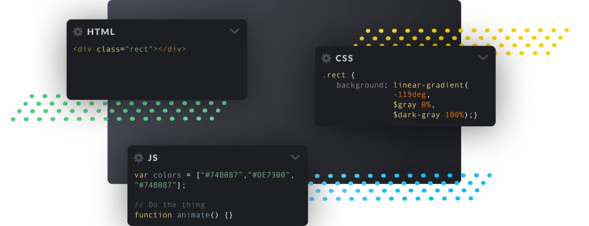
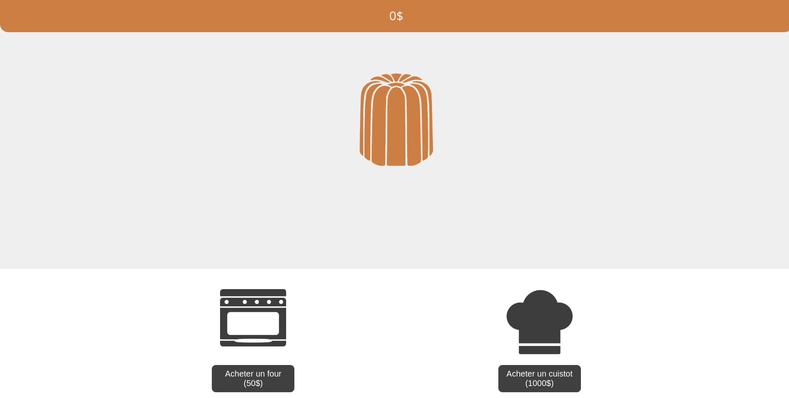

# Cannelé clicker musclé (svelte)

## Introduction

Chef Pesos, président d’une grande société californienne, passe ses vacances en France dans la ville de Bordeaux. En pleine exploration culinaire, il goûte à un cannelé si bon qu’il en devint amoureux. Il décide alors d’abandonner son poste afin de se consacrer entièrement à sa nouvelle passion pour ce moelleux dessert et ce, en participant à la création de la nouvelle pâtisserie de la ville !


Il obtient les clés de sa nouvelle boutique en proposant son projet à son ami Gippé, jeune cadre dynamique, pour qui la question est vite répondue. En revanche, le local qu’ils ont obtenu n’a pas vraiment fière allure. C’est alors que les associés font appel à vos services de développeur pour
l’aider à concevoir la pâtisserie des rêves du Chef.

## II. Consignes
Découvrons ensemble votre mission en commençant par parler un peu de développement Web.

Votre objectif est de réaliser un site internet !

Un navigateur ne reconnaît que 3 langages:

- **Le HTML:** Un langage de balisage qui permettra de placer les éléments visibles sur la page.
- **Le CSS:** Un langage de stylisation faisant prendre forme votre page HTML
- **Le JS:** Un langage de scripting permettant de créer des intéractions sur votre page.



Il est tout à fait possible et imaginable de faire un site internet en utilisant uniquement du HTML, du CSS et du JS. Cependant, cela peut vite devenir très compliqué et fastidieux. C'est pourquoi il existe des librairies qui vont nous permettre de simplifier le développement de notre site. Pour cela, nous allons utiliser **Svelte**.


Svelte est une librairie qui va nous permettre de créer des composants réutilisables et de les intégrer dans notre site. Cela va nous permettre de simplifier le développement de notre site et de le rendre plus lisible.

Pour le sujet d'aujourd'hui **nous vous proposons un projet deja créé**. Il est composé des bases d'un projet svelte.

## Svelte et comment lancer votre site

Pour créer votre site nous allons utiliser SvelteKit. SvelteKit est un framework web pour construire des applications web modernes et performantes en utilisant Svelte, un outil de compilation de code JavaScript. SvelteKit facilite la création d'applications web à partir de zéro, en offrant une structure de projet cohérente et en intégrant des fonctionnalités telles que le routage, le traitement des formulaires, la gestion des sessions, la génération de pages statiques et bien plus encore.

### Lancer le site

Pour commencer, nous allons lancer le site web. Pour cela, il faut ouvrir un terminal et se placer dans le dossier du projet. Une fois dans le dossier, il faut lancer la commande suivante:

```bash
npm install
```

Cette commande va installer toutes les dépendances nécessaires au bon fonctionnement du projet. Une fois les dépendances installées, il faut lancer la commande suivante:

```bash
npm run dev -- --open
```

Cette commande va lancer le serveur de développement de SvelteKit et va ouvrir le site dans votre navigateur par défaut.

### Structure du projet

Le projet est composé de plusieurs dossiers et fichiers. Nous allons voir ensemble ce que contiennent ces dossiers et fichiers.

#### Dossier racine

Le dossier racine contient les fichiers de configuration du projet. Il contient notamment le fichier `package.json` qui contient les dépendances du projet. Il contient également le fichier `svelte.config.js` qui contient la configuration de SvelteKit.

Ces fichiers ne sont pas à modifier.

#### Dossier src

Le dossier src contient tous les fichiers sources du projet. Il contient notamment le dossier `routes` qui contient les fichiers de routage du projet. Il contient également le dossier `lib` qui contient les fichiers de configuration de SvelteKit.

A la racine de dossier il y a le fichier app.html qui contient le code HTML de base de votre site. Il n'est pas nécessaire de le modifier.

le seul fichier à modifier est le fichier `src/routes/index.svelte`. Ce fichier contient tout le code necessaire pour afficher notre site web.

#### autres dossiers

Les autres dossiers sont des dossiers de configuration de SvelteKit. Ils ne sont pas à modifier.


## revenons à notre projet

Votre mission est de réaliser un mini-jeu type "clicker" autour de l'univers du cannelé.

Vous avez à votre disposition une petite base pour commencer : un squelette Svelte (je rappel que le seul ficher à modifier est le fichier `src/routes/+page.svelte`).

Ce fichier contient :
- une balise `<script>` qui contient le code javascript de la page
- une balise `<style>` qui contient le code css de la page
- une balise `<body>` qui contient le code html de la page

la basile `<sryle>` contient deja tout le code css necessaire pour afficher le site web. Il n'est pas nécessaire de le modifier.

## Construisons notre page

Notre page finale devrait ressembler à ce qui suit:


L'élément de base en HTML est la **"division"** (ou `<div>`). C'est simplement une boite vide qui peut contenir d'autres éléments ou juste exister seule.

Il existe aussi d'autres éléments plus spécifiques comme le **"paragraphe"** (`<p>`) qui sert a contenir du texte.

### Reprenons notre page depuis le début...

On voit dans un premier temps l'argent du joueur tout en haut que l'on va représenter à l'aide d'un paragraphe ayant pour identifiant unique "score".

Certains sont perdus ?

Je reprend, pour déclarer un paragraphe en HTML on ouvre et ferme une balise `<p>` dans notre `<body>`: 
```html
<p></p>
```

Pour distinguer ce paragraphe des autres de la page on peut lui donner un identifiant unique ("id") en l'ajoutant simplement à la balise d'ouverture:
```html
<p id="score"></p>
```

>:info !icon:info-circle L'id est un attribut de l'élément, il en existe d'autres et on les ajoutes toujours dans la balise d'ouverture comme au dessus.

Pour finir, on peut ajouter du texte dans notre paragraphe:
```html
<p id="score">0$</p>
```

### Pour les prochains éléments, on va aller plus vite !

Sous notre score on doit créer une `<div>` ayant pour identifiant "cannele". Cette div ne contient rien pour l'instant.

Après avoir fermé la balise précédente, on crée une nouvelle div, ayant pour id "shop", qui contient une div pour chaque amélioration à acheter. Pour l'instant on va créer les divs "four" et "cuistot".

Chacune des div concernant une amélioration doit contenir une balise `<button>` avec un texte incitant à l'achat de l'amélioration.

C'est bon c'est fini ! Vous pouvez sauvegarder le fichier et retourner sur votre navigateur. Svelte aura fait sa magie et actualisé la page pour vous montrer le résultat.

> Si ça ne marche pas totalement, n'hésitez pas à appeler un cobra !

_Je rappelle que vous n'êtes pas obligés d'utiliser le style fourni. Si vous avez une idée de design en particulier, vous pouvez modifier le contenue de la balise `<script>` ou créer le votre..._

## Le jeu

Si vous avez bien suivi, nous avons placé et stylisé nos éléments, il nous reste le troisième langage de notre triangle du web: le **JavaScript** _(qui permet l'automatisation et l'intelligence de notre site)_.

Faisons un petit listing de ce que nous devons implémenter:

- Cliquer sur le cannelé permet de le cuisiner, ça rapporte 1\$
- Les boutons acheter un four et acheter un cuistot doivent être fonctionnels

Lors de l'achat d'une amélioration:

- Si le joueur n'a pas assez d'argent, ne rien faire
- S'il a assez d'argent:
  - Débiter l'argent
  - Ajouter l'effet de l'amélioration\*
  - Augmenter le prix de x1.5

\*Les effets des améliorations sont les suivants:

- Chaque four rapporte un cannelé (donc 1\$) de plus lors de la préparation.
- Les cuistots rapportent automatiquement un cannelé par seconde (2 cuistots en rapportent 2... etc)

> Dans l'idéal, les prix doivent rester entiers. On arrondira les prix s'il y a une virgule.

Pour créer ces fonctionnalités nous allons modifier le contenue de la balise `<script>` qui est resté tristement vide jusque là.

Dans notre fichier de script nous allons créer des fonctions que nous associerons aux éléments de notre page.

### Exemple

```javascript
/*Toutes ces cariables sont globales,
elles sont accessibles partout dans le fichier
et pourrons etre incoprorées dans notre code HTML*/

let argent = 0;
let fours = 1;

// Déclaration de la fonction "cuisiner"
function cuisiner() {
	// On ajoute de l'argent selon le nombre de fours
    argent += fours;
}
```

maintenant il va faloir modifier un petit peu notre code HTML pour que notre page affiche le contenue de notr evariable argent.

En Svelte, on utilise les accolades `{}` pour afficher le contenue d'une variable.

```html
<p id="score">{argent}$</p>
```

> !icon:exclamation-triangle Attention, il faut bien mettre les accolades dans la balise `<p>` et non dans l'attribut `id` !

> Essayez de modifier le contenue de la variable argent, sauvegardez le fichier et actualisez la page pour voir le résultat.

Nous allon maintenant associer notre fonction `cuisinier` à notre élément `<p>`.
Pour cela, on va utiliser l'attribut `on:click` de la balise `<p>`.

```html
<p id="score" on:click={() => {cuisiner()}}>{argent}$</p>
```

Explication :

- `on:click` est un attribut de la balise `<p>` qui permet de définir une action à effectuer lors d'un clic sur l'élément.
- `() => {cuisiner()}` est une fonction anonyme qui appelle la fonction `cuisiner` lorsque l'on clique sur le cannelé.
- `cuisiner()` est la fonction que nous avons déclarée précédemment.
- Nous ne pouvons pas appeler directement la fonction `cuisiner` car sinon elle serait appelée à chaque chargement de la page. Nous devons donc créer une fonction anonyme qui appelle la fonction `cuisiner` lorsque l'on clique sur le cannelé.

Désormais, cliquer sur la div "cannele" executera la fonction "cuisiner".

Maintenant qu'on peut cuisiner des cannelés je vous laisse vous occuper des fonctions `acheterFour()` et `acheterCuistot()`, normalement les noms parlent d'eux-mêmes ;).

## Les cuistots

Les cuistots doivent rapporter un certain nombre d'agent toutes les secondes.

Si on y réfléchit bien, c'est exactement comme la fonction "cuisiner" sauf qu'on ne dépend plus du nombre de four mais du nombre de cuistots.

On va créer la fonction ```cuistot()``` qui va rapporter autant d'argent qu'on a de cuistot.

Maintenant nous devons faire en sorte que cette fonction s'execute toutes les secondes.

Le **JavaScript** propose la fonctionnalité `setInterval` qui permet d’exécuter une fonction à un intervalle précis en millisecondes.

```js
setInterval(cuistot, 1000);
```

Nous avons maintenant un jeu fonctionnel !

## Les améliorations

Nous pouvons maintenant améliorer l'esthétique de notre jeu en ajoutant des images et des clarifications.

### Clarifications

Nous allons ajouter des clarifications sur les boutons d'achat pour que le joueur comprenne ce qu'il achète. On peut par exmeple marqué le prix de ce que l'on achete sur le boutton.

> on peut par exemple utiliser la balise `<br>` pour faire un retour à la ligne à l'interieur d'une autre balise.

### Images

Nous allons ajouter des images pour rendre notre jeu plus esthétique.

Pour cela, nous allons utiliser la balise ``.

> !icon:exclamation-triangle Vous devez stocké les image que vous voulez utiliser dans le dossier `static` de votre projet. Sans quoi elles ne seront pas accessibles depuis votre page. Ou alors vous pouvez utiliser des images en ligne.

Je vous propose d'ajouter un magnifique cannelé sur la page d'accueil.

```html
<div id="cannele">
    
</div>
```

## Trop ce n’est jamais assez !

Le Chef est très content de sa boutique ! Grâce à vous, il possède la meilleure pâtisserie de toute la ville et peut partager son amour des cannelés à des milliers de clients chaque jour.

Félicitations, vous êtes venus à bout des demandes de votre patron, le magnifique Chef Pesos !

Vous pouvez fièrement affirmer être un développeur accompli dans la confection de cannelés et pourrez désormais vous vanter d’avoir construit la meilleure pâtisserie de la ville !

Cela dit, le Chef ne cesse de voir les choses en grand : Ses caisses débordent de recettes et sa tête d’imagination.

Comme il vous aime bien, il souhaite continuer de travailler avec vous sur les points suivants :

- Ajouter du son
- Améliorer l'interface
- Sauvegarder l'argent lors du rafraîchissement de la page
- Ajouter des améliorations
- Animer d'avantage le jeu
