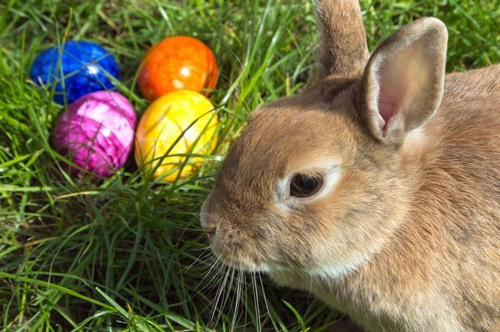
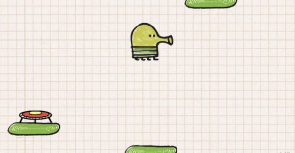
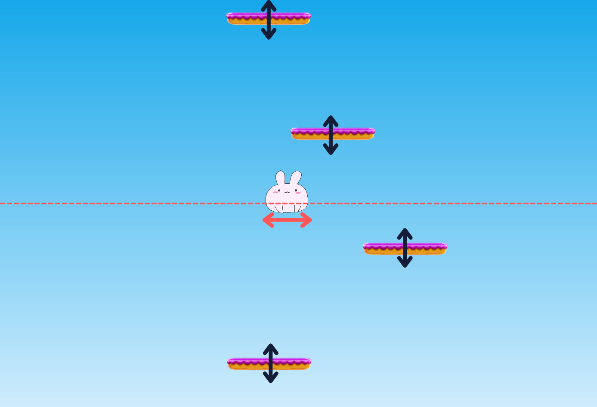
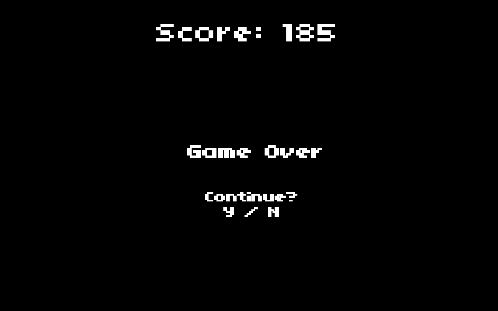

## I. Histoire

Dans un paisible village, les festivités de Pâques étaient menacées par une équipe de poules malicieuses qui, par jalousie, avaient volé tous les œufs et les avaient cachés haut dans le ciel sur des plateformes flottantes.

Bunny, un courageux petit lapin, était déterminé à sauver la fête en récupérant les précieux œufs. Chaque saut de Bunny était crucial pour surmonter les obstacles et récupérer les œufs avant qu'il ne soit trop tard.

Rejoignez Bunny dans son aventure palpitante et aidez-le à sauver la tradition de Pâques pour le bonheur des villageois !



## II. Créer un jeu

Les lapins codent très mal, mais ils savent sauter ! Aidez les lapins à sauter en codant un jeu de plateforme en Javascript, HTML, CSS tel un grand lapi-développeur web.

Pour vous épauler dans la création du jeu, on met à votre disposition quelques bases de JavaScript qui vous permettront de gagner un peu de temps.

### Comprendre les fichiers fournis

Sont mis à votre disposition, differents fichiers.

- Le fichier **index.html** permet d'accéder à votre jeu depuis le navigateur. Double-cliquer dessus l'ouvrira.

- **estethique.css** contrôle quelques aspects du style de votre jeu.

- **scripts/graphic.js** contient des bases d'implémentation vous permettant de créer votre jeu. Vous n'avez rien à toucher dans ce fichier, vous pourrez utiliser ce code depuis celui de votre jeu.

- **assets/** vous propose quelques éléments de base pour votre jeu.

- **scripts/game.js** est le fichier qui contiendra votre implémentation du jeu.

Un jeu c'est une boucle principale, qui tourne à l'infini.

> Alors le jeu ne s'arrête jamais ? Je répondrais que ça dépend de votre notion de "jamais".
>
>\- Davdglzn

**Dans cette boucle on retrouve 4 points clés.**

- Nettoyer la fenêtre pour retirer les éléments précedemment affichés.

- Récuperer et traiter les évenements liés aux intéractions de l'utilisateur.

- Calculer les déplacements des différents personnages.

- Rendre à l'écran les éléments à afficher.

Ces différentes étapes sont à implémenter dans la fonction **mainLoop** donnée dans le fichier **game.js**.

```js
renderer.mainLoop(() => {
    // Game mainloop
});
```

### Différentes méthodes utilisables

Pour intéragir avec le rendu du jeu, différentes fonctions sont appellables.

- **renderer.clear()** permet de nettoyer le contenu précedemment affiché à l'écran.

- **renderer.pollEvents()** permet de récuperer tous les événements qui se sont produits depuis le dernier tour de boucle.

    _Vous pouvez pouvez l'utiliser comme il suit._

```js
const events = renderer.pollEvents();

if (Utils.isKeyDown(events, 'r')) {
    // Touche R pressée
}
```

- **renderer.drawSprite(sprite, x, y)** affiche un element à l'écran aux coordonnées données.

    Un sprite se déclare comme il suit, avec le chemin vers l'image et la taille qu'il doit avoir à l'écran.

```js
const bunny = new Sprite("assets/lapinou.png", 100, 100);
```

- **renderer.drawText(text, size, x, y)** affiche du texte aux coordonnées indiquées.

    On l'utilise comme il suit:

```js
renderer.drawText("Hello", 13, 0, 0);
```

- **renderer.canvas** vous donne des spécificités sur la fenêtre de rendu. Vous pouvez par exemple utiliser.

```js
const windowWidth = renderer.canvas.width;
const windowHeight = renderer.canvas.height;
```

>:info L'origine de l'axe y est au centre de l'écran. Ainsi, afficher un élément en coordonnée y = 0 l'affiche au milieu de l'écran.

## Déplacer Bunny

La première étape est de faire bouger Bunny.

Pour ce faire, on peut garder une variable de sa position sur l'axe des abscisses.

```js
var bunnyX = 0;
```

On peut maintenant agir sur cette variable dans la boucle principale et s'en servir lors du rendu.

```js
renderer.mainLoop(() => {
    if (Utils.isKeyDown(events, 'ArrowRight')) {
        bunnyX += 2;
    }
    renderer.drawSprite(bunny, bunnyX, 0);
});
```

>:info On procédera de la même manière pour le reste des mouvements.

## Bunny boing boing ^^

Pour se rapprocher des précieux oeufs, Bunny doit apprendre à sauter.

> Si tu n'as pas fait spé physique, va falloir s'accrocher... lol

Un saut, c'est une accélération vers le haut.

Cette acceleration donne un élan à la vitesse de l'objet, puis au fur et à mesure que l'objet gagne de la hauteur, cette vitesse diminue pour finalement s'équilibrer au sommet du saut.

S'enchaîne alors la chute qui est une acceleration orientée vers le bas cette fois-ci, jusqu'à l'impact avec le sol.


Ça va ?

On peut implementer ça de façon assez simple en gardant une variable de la vitesse verticale de Bunny.

```js
var ySpeed = 0;
var bunnyY = 0;
```

On doit maintenant interagir sur la vitesse de Bunny lorsqu'on lui demande de sauter.

> Le saut de Bunny doit se déclencher automatiquement lorsqu'il ré-attéri au sol.

```js
renderer.mainLoop(() => {

    // [...]

    // On augmente ou diminiue l'altitude de bunny selon sa vitesse verticale
    bunnyY += ySpeed;

    if (...) {
        // Du temps que Bunny ne touche pas le sol,
        // il perd de la vitesse verticale.
    } else {
        // Lorsqu'il attérit, on lui redonne une impulsion verticale.
    }

    // On affiche Bunny selon ses coordonnées.
    renderer.drawSprite(bunny, bunnyX, bunnyY);
});
```

## Les plateformes

Bunny ne pourra pas atteindre les oeufs sans plateformes volantes.

On souahite générer aléatoirement les plateformes que Bunny va utiliser.



>:warning Le nombre de plateformes doit être infini, il faudra surement en génerer de nouvelles régulièrement.
>
> À vous de trouver le bon moment pour le faire.

Il est important de s'assurer que les sauts soient toujours réalisables, il est donc peut-être pertinent de determiner la position d'une nouvelle plateforme en fonction de l'ancienne.

Pour conserver les plateformes que l'on a généré, on peut utiliser une liste.

```js
const plateforms = [];

function addNewPlatform() {
    const simplePlatform = {x: 0, y: 0};
    plateforms.push(simplePlatform);
}
```

!pagebreak

Le niveau étant infini, il serait judicieux de garder Bunny constament au centre de l'écran _(y = 0 ?)_ et déplacer les plateformes autour de lui.



>:info Cette partie peut s'avérer être une tâche complexe sans plus d'explications. N'hésitez pas à soliciter un Cobra pour discuter de l'implémentation que vous pourriez mettre en place pour résoudre cette étape.

## Le score et la défaite

Si notre cher Bunny était amené à tomber d'une plateforme il aura malheureusement échoué sa mission. On pourra alors afficher son score.

À vous de déterminer la façon dont vous voulez calculer le score de de Bunny et déterminer sa défaite.



## On va plus loin ?

Bravo d'être arrivé jusqu'ici.

On va plus loin ?

Pourquoi ne pas proposer une fin heureurse à l'aventure de Bunny ? Ajouter des ennemis sur son chemin où des bonus à récupérer ?

Sentez vous libres d'experimenter de nouvelles choses !

