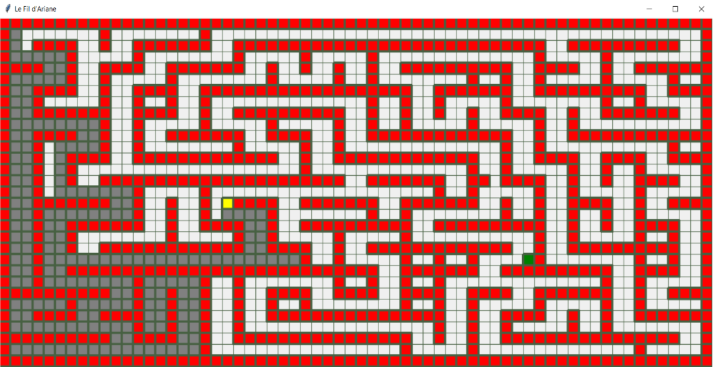

## I. Introduction

Le python est un langage de programmation qui est apparu au début des années 90, il se caractérise par sa structure orientée objet comme le Java mais il est beaucoup plus abordable dans sa syntaxe et il est plus facile d'utilisation pour faire de l’algorithmie !
Il est particulièrement utilisé comme langage pour automatiser des tâches simples, comme un script qui récupérerait la météo sur Internet, ou bien du traitement de données.

Fun Fact, le nom du langage qui nous intéresse ici vient de l’affection de Guido pour le « Monty Python Flying Circus », une comédie surréaliste créée par un groupe comique anglais « Monty Python ». 

Autre détail amusant, jusqu’en 2018, le créateur du langage Python possédait au sein de la communauté Python le titre de « BDFL » c’est-à-dire de « Benevolent Dictator for Life » ou « Dictateur Bienveillant à Vie ». Cela signifie qu’il tranchait en dernier ressort pour les décisions concernant l’évolution du langage.


## II. Consignes
-	Pour l’installation veuillez suivre le tutoriel « Installation Python et ses outils ».
-	Le nom du repository est : FilAriane_cc. Si cela ne vous dit rien nous vous invitons à lire « le coffre à jouet du petit git ».
-	Demandez de l’aide aux Cobras en cas de problème d’installation. Si plus rien ne va, recommencez depuis le début en faisant bien attention à toutes les étapes ! 
-	Si vous bloquez, rappelez-vous que vous êtes accompagné(e) ! Demandez de l’aide à vos camarades ou à un Cobra.
-	Ce document a pour objectif de vous indiquer l’objectif du sujet, mais c’est à vous de trouver l'algorithme. 
-	Internet est un outil formidable pour découvrir le fonctionnement des choses, servez-vous-en régulièrement !

## III. Le Fil d’Ariane
En tant que mythologicien, vous avez toujours été fasciné par le mythe du fil d’Ariane. Un beau jour, vous avez été envoyé pour résoudre le labyrinthe une bonne fois pour toute.

Arrivé sur place, vous commencez à avancer dans le labyrinthe tout en posant des balises de repérage. Au bout de plus d’une heure, vous décidez de rebrousser chemin car vous n’avez plus de balise. En vous retournant, vous apercevez des énormes traces de pied et toutes vos balises ont disparu. 

Par chance il vous reste votre téléphone. Servez-vous-en comme GPS pour attendre la sortie. Aucune application n’existe pour cela, vous allez devoir la faire par vous-même !
Le but du projet est donc de résoudre un labyrinthe à l’aide d’un algorithme.

Pour cela vous allez devoir continuer le code du fichier « dedale.py ».


L’objectif est de faire un algorithme le plus rapide possible. Il n’y a pas vraiment d'intérêt à rentrer le chemin en dur.

Soyez créatif ! Si vous voulez aller plus loin, vous pouvez essayer de le faire par vous-même, sinon il en existe plusieurs assez simple de disponible sur internet comme le **« A* »** ou le **« Dijkstra »**.

### Droit dans le mur
Avant de commencer, vous devez avoir avec votre sujet 2 fichiers en plus.

-	**map.txt** : C’est la carte de votre labyrinthe, les « x » représentent les murs, les « - » les chemins et le « o » la sortie. Vous devez aussi savoir que vous commencerez toujours en haut à gauche du labyrinthe.
-	**dedale.py** : C’est le fichier dans lequel vous allez implémenter votre algorithme.

Cela étant dit, vous pouvez tester votre programme en écrivant dans votre terminal :

```sh
python3 dedale.py
```

Si tout se passe bien, vous devriez avoir une fenêtre comme celle-ci :


### LabyTips & LabyTrics

Bon cela étant, votre algo ne fait pas grand-chose pour le moment. Pour l’améliorer, vous devez remplir la fonction « algo ».

Vous pouvez appeler les fonctions « right », « down », « left » et « up » pour vous diriger.

Avant de vous lancer dans votre algorithme, vous devez avoir en tête les points ci-dessous :

-	Vous avez accès à une variable « map » qui contient toutes les valeurs à jour de la carte.
-	Vous avez aussi accès aux variables « posX » et « posY » qui vous donne votre position en les utilisant comme ceci : « map[posY][posX] » (ces variables sont mises à jour automatiquement).
-	Les valeurs de la map sont : « x » = 1 / « - » = 0 / « o » = 2 / -1 pour les cases déjà visitée.
-	La fonction algo est appelée en boucle jusqu’à que « map[posY][posX] » soit égale à 2, donc la sortie.
-	L’affichage est mis à jour à chaque fois que la fonction algo est finie.
-	La variable « value » envoyée en paramètre dans la fonction algo ne sert qu’à compter le nombre de fois que la fonction algo est appelée. Elle peut être utile une fois l’algo terminé.
-	Une variable « path » est mise à disposition. Vous connaîtrez son utilité dans la partie suivante.
Veillez à ne faire qu’une action à chaque appel de la fonction « algo ».

### En route vers la sortie


Pour bien commencer essayez de changer la fonction « down » par « right » dans la fonction et voyez ce qu’il se passe.

Une fois cela fait, faites une condition basique pour faire tourner votre personnage lorsqu’il se bloque dans un coin. 

Enfin, vous pouvez vous aider de la variable « path » pour sauvegarder le chemin emprunté et donc pouvoir revenir en arrière si besoin.

**À vous de jouer !**



## IV. Le bout du tunnel

Félicitations, vous avez un algorithme fonctionnel. Vous allez pouvoir partir à l'aventure !

Maintenant que vous avez votre GPS pour labyrinthe vous allez pouvoir le continuer pour l'améliorer.

Voici quelques petits exemples d’amélioration :
-	Modifier la carte pour mettre votre algorithme à rude épreuve.
-	Essayez de l’optimiser pour qu’il soit plus rapide.
-	Vous pouvez faire de la gestion d’erreurs. (Vérifier que le labyrinthe a bien un début et une fin par exemple).
-	Créer un générateur de labyrinthe pour tester votre algorithme.
	Si le labyrinthe à plusieurs chemins possible, trouvez le chemin le plus court.

>:info !icon:circle-info Si vous êtes curieux, pensez à poser vos questions aux Cobras. Ils seront ravis de partager leurs connaissances avec vous.


 