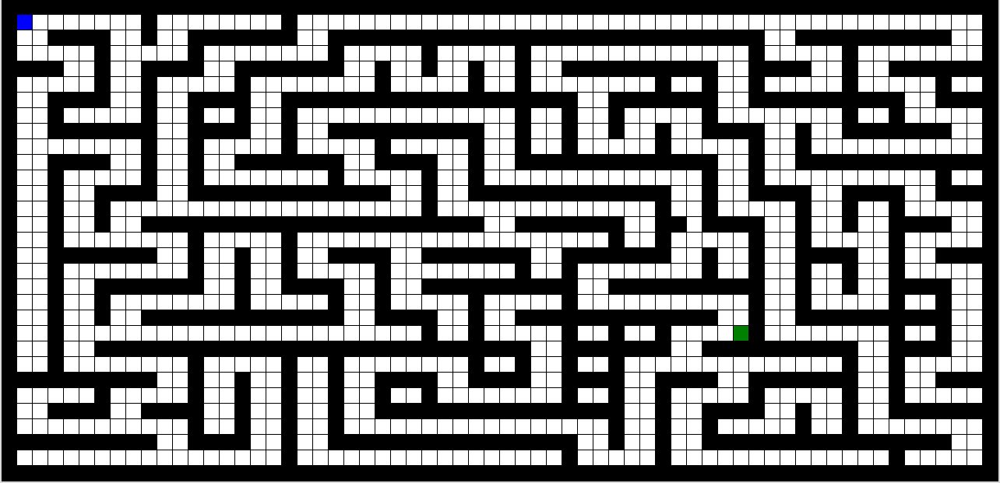
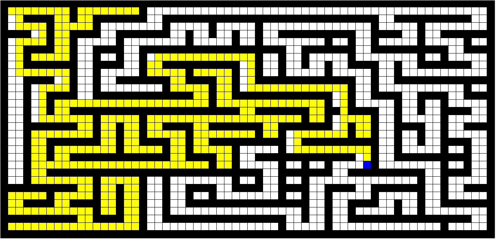

## I. Introduction
Le python est un langage de programmation qui est apparu au début des années 90, il se caractérise par sa structure orientée objet comme le Java mais il est beaucoup plus abordable dans sa syntaxe et il est plus facile d'utilisation pour faire de l’algorithmie !

Fun Fact, le nom du langage qui nous intéresse ici vient de l’affection de Guido pour le « Monty Python Flying Circus », une comédie surréaliste créée par un groupe comique anglais « Monty Python ».

Autre détail amusant, jusqu’en 2018, le créateur du langage Python possédait au sein de la communauté Python le titre de « BDFL » c’est-à-dire de « Benevolent Dictator for Life » ou « Dictateur Bienveillant à Vie ». Cela signifie qu’il tranchait en dernier ressort pour les décisions concernant l’évolution du langage.


## II. Règles du Coding Club
- **L'utilisation de ChatGPT, ou toute forme d'intelligence artificielle sera considéré comme de la triche\.**
- Avant le repas, fermez votre ordinateur.
- Lors du repas. On ne mangera pas sur les tables des ordinateurs pour éviter les accidents. (Sauf exceptions)
- Après le repas, nettoyez après vous et jetez vos déchets.

>:danger Si un Cobra vous prend en train de tricher, il se doit de supprimer votre avancement sur le projet.

## III. Comment commencer
Si vous travaillez depuis un ordinateur fourni par le Coding Club, vous devez avoir toutes les dépendances nécessaires pour commencer. Vous pouvez ignorer cette étape.
Si ce n'est pas votre cas, et que vous n'avez pas python sur votre ordinateur. **Faites appel à un Cobra.**

>:info !icon:circle-info Les Cobra sont les étudiants qui organisent ces événements pour vous. Ils sont tournent dans la salle.

## IV. Que faire quand tu es coincé(e)
- Premièrement, soyez sûr de ce qui vous coince et ce que vous essayez de faire. (C'est plus facile d'aider quelqu'un qui pose une question précise au lieu d'une question vague.)
- Deuxièmement, demandes aux personnes autour de toi! Ce n'est pas un examen, vous êtes là pour travailler ensemble :)
- Troisièmement, la réponse est à coup sûr sur **Google**.
- Dernièrement, si aucune de ces étapes t'as débloqué. Demandes à un Cobra!

>:info !icon:circle-info PS: Si les cobras ne savent pas ils demanderont à Google.

## V. Le Fil d’Ariane
En tant que mythologicien, vous avez toujours été fasciné par le mythe du fil d’Ariane. Un beau jour, vous avez été envoyé pour résoudre le labyrinthe une bonne fois pour toute.

Arrivé sur place, vous commencez à avancer dans le labyrinthe tout en posant des balises de repérage. Au bout de plus d’une heure, vous décidez de rebrousser chemin car vous n’avez plus de balise. En vous retournant, vous apercevez des énormes traces de pied et toutes vos balises ont disparues.

Par chance il vous reste votre téléphone. Servez-vous-en comme GPS pour attendre la sortie. Aucune application n’existe pour cela, vous allez devoir la faire par vous-même!

Le but du projet est donc de résoudre un labyrinthe à l’aide d’un algorithme.

Pour cela vous allez devoir continuer le code du fichier « dedale.py ».


L’objectif est de faire un algorithme capable de vous sortir de n'importe quel labyrinthe. Il n’y a pas d'intérêt à écrire chemin case par case car il peut changer en fonction du labyrinthe.

Essayez de faire un algorithme simple pour commencer, puis si vous vous sentez pousser des ailes. Vous pouvez appliquer des algorithmes plus complexes que vous pouvez trouver sur internet.

### Droit dans le mur
Avant de commencer, vous devez avoir avec votre sujet 2 fichiers en plus.

- **map.txt** : C’est la carte de votre labyrinthe, les "x" représentent les murs, les "-" les chemins et le "o" la sortie et les cases déjà visitées se transformeront en ".". Vous devez aussi savoir que vous commencerez toujours en haut à gauche du labyrinthe.
- **dedale.py** : C’est le fichier dans lequel vous allez implémenter votre algorithme.

Cela étant dit, vous pouvez tester votre programme en écrivant dans votre terminal :

```sh
python3 dedale.py <maze.txt>
```

Si tout se passe bien, vous devriez avoir une fenêtre comme celle-ci :



Le Carré Bleu correspond à votre case de départ.
Le Carré Vert correspond à la fin du labyrinthe.
Une case déjà visitée apparaitra en Jaune.

### LabyTips & LabyTrics
Bon cela étant, votre algo ne fait pas grand-chose pour le moment. Pour l’améliorer, vous devez remplir la fonction `algorithm`.

Vous pouvez appeler les fonctions `right`, `down`, `left` et `up` pour vous diriger.

Avant de vous lancer dans votre algorithme, vous devez avoir en tête les points ci-dessous :

- Vous avez accès à une variable "map" qui contient toutes les valeurs à jour de la carte.
- Vous avez aussi accès aux variables "posX" et "posY" qui vous donne votre position en les utilisant comme ceci : `map[posY][posX]` (ces variables sont mises à jour automatiquement).
- Les valeurs de la map sont : "x" / "-" / "o" / "." pour les cases déjà visitée.
- La fonction `algorithm` est appelée une seule fois, à vous de vous arrêter à la fin du labyrinthe.
- L’affichage est mis à jour à chaque fois que l'une des fonctions de mouvement est exécutée.
- Une variable "path" est mise à disposition. Vous connaîtrez son utilité dans la partie suivante.

### En route vers la sortie
Pour bien commencer essayez de changer vous déplacer d'une case à la fois pour comprendre le fonctionnement.
Puis ensuite, dans une direction jusqu'à un mur.
Puis réfléchissez à comment changer de direction.

A un moment donné, vous serez dans un cul-de-sac. Au quel cas, vous devrez rebrousser chemin jusqu'à que vous puissiez changer de direction.

**À vous de jouer !**



## VI. Le bout du tunnel
Félicitations, vous avez un algorithme fonctionnel. Vous allez pouvoir partir à l'aventure !

Maintenant que vous avez votre GPS pour labyrinthe vous allez pouvoir continuer de l'améliorer.

- Modifier la carte pour mettre votre algorithme à rude épreuve.
- Essayez de l’optimiser pour qu’il soit plus rapide.
- Vous pouvez faire de la gestion d’erreurs. (Vérifier que le labyrinthe a bien un début et une fin par exemple).
- Créer un générateur de labyrinthe pour tester votre algorithme. Si le labyrinthe à plusieurs chemins possible, trouvez le chemin le plus court.

>:info !icon:circle-info Si vous êtes curieux, pensez à poser vos questions aux Cobras. Ils seront ravis de partager leurs connaissances avec vous.
