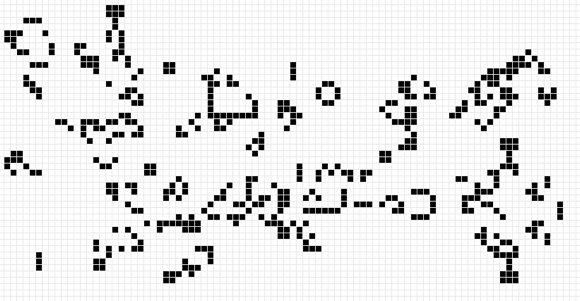
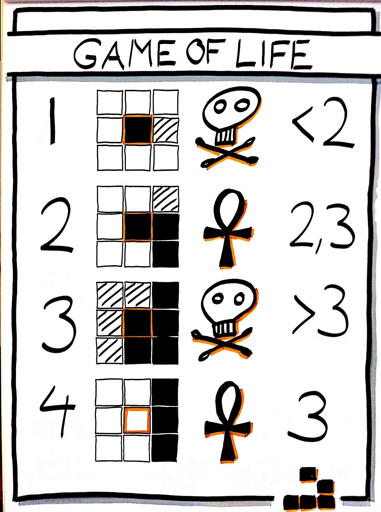

## I. Introduction

Game Of Life est un automate cellulaire créé par John Conway. Ce jeu a été créé en s'inspirant de phénomènes biologiques et nous permet d'observer l'évolution de plusieurs cellules dans un plan.



## II. Règles du jeu

Le jeu se déroule dans une grille à deux dimensions. Les cellules évoluent au tour par tour selon des règles simples :

- Toute cellule vivante avec moins de deux voisins vivants meurt (appelée sous-population).
- Toute cellule vivante avec plus de trois voisins vivants meurt (appelée surpopulation).
- Toute cellule vivante avec deux ou trois voisins vivants vit, inchangée, jusqu'à la génération suivante.
- Toute cellule morte avec exactement trois voisins vivants prend vie.



## III. Application

Votre objectif est de recréer le **Game Of Life** de Conway en Python.

Pour commencer, instanciez une nouvelle partie et chargez une map :

```py
from cc_gameoflife.core import *
import time

game = GameOfLife()
game.load_map("maps/map.txt")
```

`game` contient deux tableaux :

- `game.grid` : la grille actuelle, sur laquelle on compte le nombre de voisins
- `game.next_grid` : la grille qui sera affichée à l'étape suivante, sur laquelle on place les cellules restantes après le dernier cycle.

_Les cellules mortes sont des 0 et les cellules vivantes sont des 1._

Maintenant nous pouvons recréer le **Game Of Life**.

Dans une boucle infinie, comptez les voisins de chaque cellule dans `game.grid` et, selon les règles du **Game Of Life**, ajoutez une cellule ou non dans `game.new_grid`.

À la fin du tour appelez `game.show_grid()` pour afficher la grille.

>:warning !icon:triangle-exclamation Pensez à rajouter un délai de 0.5s entre chaque itération.