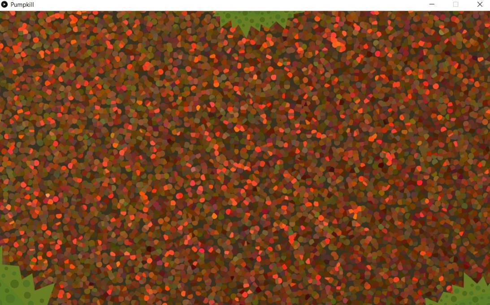
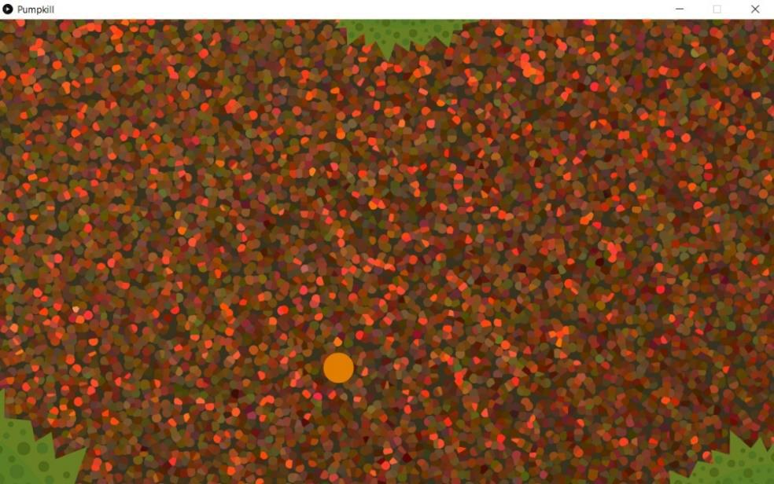
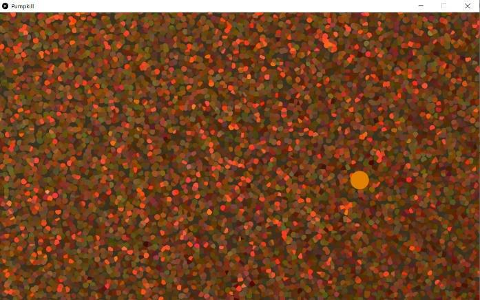
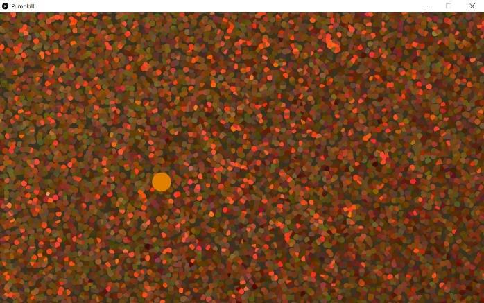
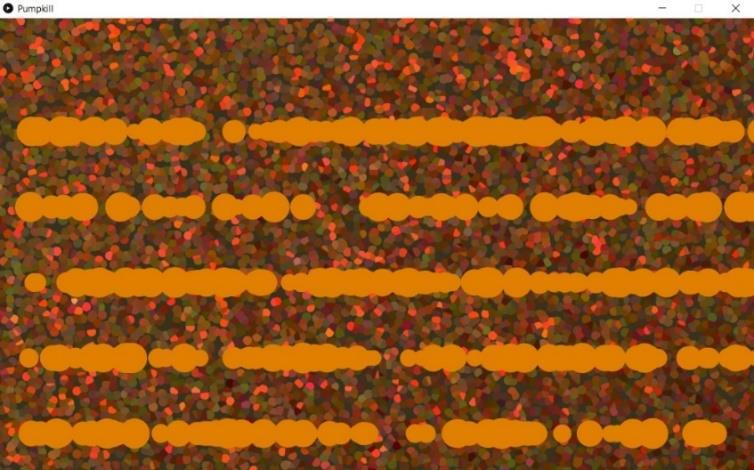
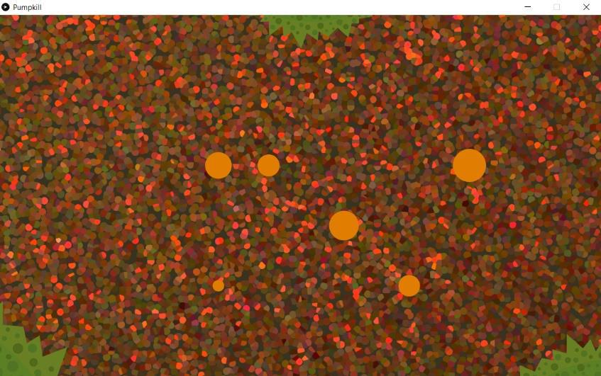

## I. Introduction

Merci d’avoir répondu présent à l’appel du village, ô Gardien Gimgim. L’heure est grave, le maléfique Jack La Trouille est en train de lever une armée de citrouilles mort-vivantes, des zombitrouilles ! Il menace d’attaquer le village demain, au soir d’Halloween, si on ne lui donne pas tous nos bonbons !


Pour protéger le village, Gimgim décide de construire une arène de combat pour s’entraîner, y attirer les zombitrouilles et enfin les combattre. Les villageois se portent volontaires pour lui donner un coup de main mais il aura besoin de son outil de Gardien, le logiciel [Processing](https://processing.org/) ! 

## II. Consignes

- Lis tout avant de commencer ! 
- Ce sujet nécessite l’environnement de développement Processing.  Tu peux  l’installer avec ce lien : [Processing - Download](https://processing.org/download). 
- Demande de l’aide aux Cobras en cas de problème d’installation. Si plus rien ne va, recommence depuis le début en faisant bien attention à toutes les étapes !
- Si tu bloques, rappelle-toi que tu es accompagné ! Demande de l’aide à tes camarades ou à un Cobra, ceux-là ne mordent pas.
- Internet est un outil formidable pour découvrir le fonctionnement des choses, sers-t'en régulièrement !

>:warning !icon:triangle-exclamation **Attention:** Le code des exemples est incomplet, tu devras rajouter/modifier quelques éléments pour que cela fonctionne. <br><br> Un `…` dans le code signifie que tu dois compléter le code par toi-même en utilisant les informations du sujet.<br>Un `//` est un commentaire pour t’aider à comprendre. Ce qui se trouve après, sur la même ligne, est ignoré par le programme.

## III. Mettre en place l’espace d’entraînement

### a. Les fondations de l’arène

Dans un premier temps, il faut une arène de combat. Pour cela, Gimgim va utiliser son arme favorite  :  Processing. Il va créer une fenêtre, qui sera le cadre dans  lequel il pourra construire son système de combat pour s’entrainer et affronter ces vilains zombitrouilles. 
 
Les fonctions `setup()` et `draw()` sont les bases de tout programme dans Processing. Elles permettent, respectivement, d’initialiser la fenêtre et d’afficher son contenu. La première fonction s’exécute au lancement du jeu, et la deuxième s’exécute pendant toute la durée du programme.

```Java
void setup()
{
    // Pour l'instant, la fenêtre ne contient rien...
}

void draw()
{
    // et donc, il n’y a rien à afficher pour le moment
}
```


### b. Une grande et belle arène

Il faut préparer l’arène à accueillir les combats d’entraînement. Pour cela, il faut donner une taille fixe à la fenêtre et afficher un arrière-plan représentant le terrain.  
 
Tu peux maintenant déclarer une [classe](https://processing.org/reference/class.html) `PImage` au début du fichier que tu a créé précédement pour te préparer à utiliser l’image :

```java
PImage background;
```

Ici, il faut donner une taille de **1200px** en largeur et **720px** en hauteur à la fenêtre. Tu pourras ensuite charger l’image nommée **“training_background.png”** dans la variable adéquate. Tu vas ajouter ces deux éléments dans la fonction `setup()` :

```java
size(..., ...); // largeur, hauteur 
background = loadImage(...); //tu charges ton image
```
Maintenant, on a besoin que les images se succèdent pour l’animation du jeu. Pour cela, va dans la fonction `draw()`, et rajoute ces éléments :

```java
clear(); // Tout est effacé de l’écran 
image(...); // Tu affiches ton image ici
```



## IV. L’entraînement de Gimgim

L’arène est en place. Cependant, le gardien est un peu rouillé au combat, il faut donc trouver un moyen d’apprendre à affronter les zombitrouilles.  Sa sœur, l’enchanteresse du village, propose alors  de  l’aider  en  créant des orbes qui feront office d’ennemis. Toutefois elle a besoin d’aide avec Processing. 
 
L’enchanteresse a créé une ***classe* Orb** qui contient toutes les propriétés d’un orbe, mais elle ne sait pas comment l’afficher. Elle a placé cette classe dans un fichier à part : `Orb.pde`.

### a. Formule d’incantation

Tout d’abord, dans le constructeur de la classe, il faut laisser le programme choisir : 
- Une taille aléatoire pour l’orbe, *entre 25 et 50*, qui sera stockée dans une variable `orb_size`.  
- Une position verticale au hasard, parmi ces cinq valeurs : *180, 300, 420, 540, 660*. Elles seront stockées dans la variable `lines`. 
- Enfin, il faut lui donner une couleur [orange](https://encycolorpedia.fr/ff7f00), stockée dans la variable `orb_color`. 
 
Complétez le constructeur de la (classe)[https://web.maths.unsw.edu.au/~lafaye/CCM/java/javaconst.htm] `Orb`, grâce aux consignes précédentes.

```java
rb_size = int(random(..., ...)); //la taille est choisie au hasard 
 
int[] lines = {..., ..., ..., ..., ...}; // les cinq hauteurs de ligne possibles 
int line_number = int(random(0, 5)); // choix aléatoire de la ligne 
 
position_x = 700; // cette valeur sera modifiée plus tard 
position_y = lines[line_number]; // hauteur de la ligne 
 
orb_color = color(..., ..., ...); // la couleur orange de l’orbe
```

### b. « Exorcizamus te omnis immundus spiritus »

Maintenant, il est temps de créer un orbe dans `JackLaTrouille.pde`, à partir de la classe fournie précédemment. Voici les étapes : 
- En haut du fichier “JackLaTrouille.pde“, déclare une classe `Orb`
- A la fin de `setup()`, initialise l’orbe déclarée
- Enfin, à la fin de `draw()`, appelle la méthode qui permet d’afficher cette orbe

```java
Orb my_orb;

void setup()
{
    // fin de la fonction
    ... = new Orb();
}

void draw()
{
    ...
    // fin de la fonction
    my_orb.display();
}

```

>:info !icon:circle-info Cela ne fonctionne pas encore, c’est normal. Tu vas obtenir un résultat dans la prochaine partie.

### c. Une lumière dans l’obscurité

Rien de nouveau à l’horizon quand tu lances ton programme. Tu appelles bien la fonction `my_orb.display()`, cependant il n’y a pas encore de code à l’intérieur. Tu vas donc ajouter et compléter le contenu à la suite dans la fonction `display()` de la classe `Orb`.

```java
// permet de mettre en place l’apparence de ton Orb 
pushStyle();
 
fill(...); // donne une couleur à ton cercle 
noStroke(); // retire les contours sur le cercle 

// le cercle est affiché
circle(..., position_y, ...); // position en x, en y et taille du rayon

// fin de l’affichage
popStyle();
```

>:info !icon:circle-info Les fonctions `pushStyle()`, `noStroke()` et `popStyle()` sont essentielles à ton programme. N’oublie pas de les ajouter.

Vous devriez obtenir ceci :

  
## V. Traject’Orbe

Tu as désormais un orbe, mais il faut faire en sorte qu’il se comporte comme un zombitrouille. Pour cela, tu vas le faire se déplacer de droite à gauche, et le faire entrer depuis l’extérieur de l’arène. <br />

Il y a plusieurs petites modifications à faire dans ton code. 

- Donne une vitesse et une position d’apparition à l’orbe dans le constructeur de la classe `Orb`
 
- Pour déplacer l’orbe,  change  sa  position  selon  sa  vitesse  dans  la  méthode  `move()`  de  la  classe `Orb`
 
```java
Orb()
{
    ... // code précédent
    // la variable qui donne une vitesse au hasard entre 2 et 5 
    speed = int(...(2, 5)); 

    // l’orbe apparaît en-dehors à droite de la fenêtre 
    position_x = 1250; 
}

void move()
{
    position_x -= ...;
}
```

- Rajoute ensuite le calcul du mouvement des orbes dans la fonction `draw()`

```java
void draw()
{
    ... // code précédent
    my_orb.move();
}
```

Et voilà qu’il avance tranquillement vers la gauche :



## VI. Orbes en folie

### a. Révocation du cercle 

Maintenant que tu peux afficher un orbe avec toutes ses propriétés et toutes ses interactions. Il ne reste plus qu’à simuler un véritable assaut de zombitrouilles ! Mais avant cela, il va falloir supprimer l’orbe qui est tout seul.

Retire la déclaration et toutes le action de ton de `my_orb` contenu dans `JackLaTrouille.pde`. <br />
Cela correspond a ligne suivante:

```java
Orb my_orb;

... = new Orb(); // contenu dans setup()

// contenu dans draw()
my_orb.move();
my_orb.display();
```

>:info !icon:circle-info Ne t’en fait pas, tu vas remplacer les lignes de code que tu viens de supprimer dans la prochaine partie. 

### b. Invocation d’un mur d’orbes

Maintenant il va falloir faire apparaître plusieurs orbes à la suite ! L’enchanteresse propose d’utiliser un (tableau)[https://processing.org/reference/ArrayList.html]. Il contiendra tous les orbes qu’elle fait apparaître, et ceux que Gimgim terrassera en seront effacés. 

Ajoute un tableau d’orbes en haut du fichier `JackLaTrouille.pde` et n'oublie pas de créer le tableau dans `setup()`.

```java
ArrayList<Orb> my_orbs;

void setup()
{
    ... // code d'avant
    my_orbs = new ArrayList();
}
```
Dans `draw()`, ajoute une boucle qui parcourt ton tableau d’orbes pour les déplacer puis pour les afficher

```java 
// chaque orbe est géré un par un 
for (int i = 0; i < my_orbs.size(); i++) 
{ 
    my_orbs.get(i).move(); // l’orbe est déplacé...
    my_orbs.get(i).display(); // ...puis affiché
}  
```

Crée une fonction `spawn()` que tu ajouteras en bas du fichier `JackLaTrouille.pde`

```java
void spawn() 
{ 
    my_orbs.add(new ...());
} 
```

>:info !icon:circle-info N'oublie pas d'ajouté ta fonction `spawn()` dans `draw()` juste avant ta boucle.



### c. Moins d’orbes s’il vous plaît ! 

Tu affiches plusieurs orbes, c’est super, mais ils apparaissent beaucoup trop vite ! Tu vas donc devoir créer une variable time_counter pour gérer le délai entre 2 apparitions d’orbes, et ainsi calmer cette déferlante sans fin !

Toujours dans ton fichier `JackLaTrouille.pde` fait les modification suivante :

```java
long time_counter; 
 
void setup()
{
    ... // code déjà écrit
    time_counter = millis(); 
}

void spawn()
{
    if (time_counter <= millis()) 
    { 
        ... // déplacer le code qui était déjà dans la fonction ici 
    
        // mettre time_counter à « maintenant + 1 seconde » 
        time_counter = millis() + ...; 
    }
}
```

>:info !icon:circle-info La fonction `millis()` te permet de lancer un chronomètre.



### d. Quand Gimgim rate sa cible 
 
 
Que se passe-t-il lorsque Gimgim rate sa cible, et que cette dernière atteint le bout de l’arène ? Et bien, la cible disparaît, tout simplement ! Pour l’instant, les conséquences d’un raté ne sont pas bien graves car ce n’est que de l’entraînement. Cependant, contre les zombitrouilles de l’affreux Jack La Trouille, ce sera une autre histoire !

Tout d’abord, il faut définir dans `is_alive()` une valeur de retour *différente de 0* pour expliquer au programme qu’il faut se comporter différemment. Tu peux faire ces changements dans la fonction `is_alive()` de la classe `Orb`, avant la ligne du ***return 0***.

```java
// si la position en abscisse de l’orbe est trop à gauche
if (... < orb_size)
{
    return 1; //on renvoie 1 au lieu de 0
}
```

La détection des orbes atteignant le bout de l’arène est en place, il ne reste plus qu’à les faire disparaître, c’est-à-dire arrêter de les afficher ! Pour cela, on va vérifier, pour chaque orbe, si le bord gauche de la fenêtre est atteint, et choisir quoi faire selon les cas. Modifie ton code dans la fonction `draw()`, en gardant les lignes avec `clear()`, `image()` et `spawn()`, puis remplace le reste par ceci :

```java
// chaque orbe est géré séparément 
for (int i = 0; i < my_orbs.size(); i++)
{
    // si is_alive() renvoie 0, l’orbe n’est pas sur le bord gauche 
    if (my_orbs.get(i).is_alive() == 0)
    { 
        my_orbs.get(i).move();
        my_orbs.get(i).display();
    }
    // sinon, l’orbe touche le bord de la fenêtre 
    else
    { 
        my_orbs.remove(i); // l’orbe est supprimé du tableau
        i--;
    }
}
```

## VII. Une arme : la pourfendeuse de zombitrouilles

Bien, maintenant que les orbes sont prêts, Gimgim va pouvoir commencer à s’entraîner. Il est donc temps qu’il sorte son arme, qui lui permettra de se débarrasser de ses adversaires ! Dans Processing, elle sera représentée par le clic de la souris. Pour cela, il te faudra ajouter une nouvelle fonction dans ton fichier `Jack_la_Trouille.pde` :

```java
void mousePressed() // la fonction est exécutée lors du clic de la souris 
{ 
    if (mouseButton == LEFT) // si tu cliques sur le bouton gauche 
    {  
 
        // il faut vérifier pour chaque orbe si le clic gauche de la souris a été activé à son niveau 
        for (int i = 0; i < my_orbs.size(); i += 1) 
        { 
            my_orbs.get(...).click(); 
        } 
    } 
} 
```

Cette fonction s’exécute automatiquement dès qu’un bouton de la souris est utilisé. On vérifie que c’est un clic gauche (**LEFT**) de la souris puis à l’aide d’une boucle, on exécute la fonction `click()` pour chaque orbe contenu dans notre tableau. Ensuite, il faut compléter la fonction `click()` dans la classe `Orb`. Celle-ci enregistre la position de la souris au moment du clic et la compare à celle de l’orbe, déterminant ainsi si tu l’as touché. Pour gérer le clic de la souris, ajoute ce code dans la fonction `click()` de la classe `Orb` :

```java
// vérification de la position du clic
if (mouseX > position_x – orb_size
  && mouseX < position_x + orb_size
  && mouseY > position_y – orb_size
  && mouseY < position_y + orb_size)
{
    clicked = true; // le clic a touché l’orbe
}
else
{
   clicked = false; // le clic ne l’a pas touché
}
``` 

Maintenant que le clic est récupéré, Gimgim va pouvoir éliminer des zombitrouilles ou des orbes, pour l’instant. Te souviens-tu de la fonction `is_alive()`, un peu plus haut ? Maintenant, tu peux y ajouter une règle avant le ***return 0*** pour que l’orbe disparaisse si tu cliques dessus : 

```java
if (... == true) // si tu cliques sur l’ennemi 
{
    return 2; // la fonction renvoie une nouvelle valeur supérieure à 0 
}
```

## VIII. Après l’effort, le réconfort ? 

**Félicitations,  Gimgim  a  réussi  à  s’entraîner  et  est  prêt  à  combattre  les  zombitrouilles  de l’affreux Jack La Trouille !**

Le village est un peu rassuré, et le moral remonte face à la menace qui pèse sur Halloween. Tu as bien mérité de te reposer... 
 
Cependant, il te reste un peu de temps pour aujourd’hui. Tu décides donc de rajouter quelques 
« petits trucs de rien du tout » à l’arène de Gimgim : 
- Un compteur de points, qui permet de savoir combien d’ennemis Gimgim bat à chaque essai. 
- L’intégration d’une musique à l’aide de la [documentation de Processing](https://processing.org/reference/libraries/sound/SoundFile.html). Choisis-en une parmi les musiques de ce [FMA (FreeMusicArchive)](https://freemusicarchive.org) ou [Pixabay](https://pixabay.com/fr/music/), qui sont libres de droits.


**Félicitations, tu as sauvé la première du Prix Juste ! Arthur et Sophie vont enfin pouvoir commencer à jouer !**

Pour aller plus loin, voici quelques idées :

- Afficher le nom du joueur victorieux
- Ajouter un timer pour gérer le temps de jeu de chaque joueur
- Créer un générateur de produit
- Ajouter un affichage plus coloré pour les textes d’affichage
- Créer une interface graphique pour le jeu grâce à PyGame
