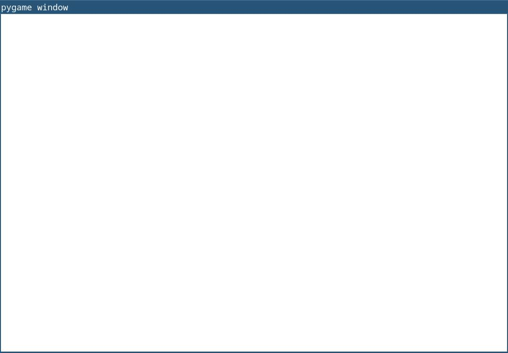
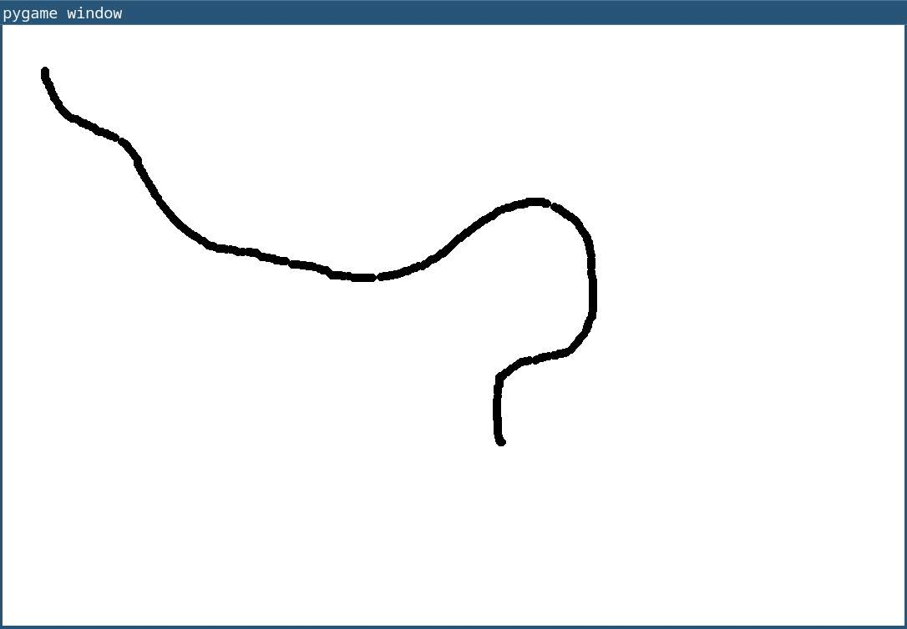
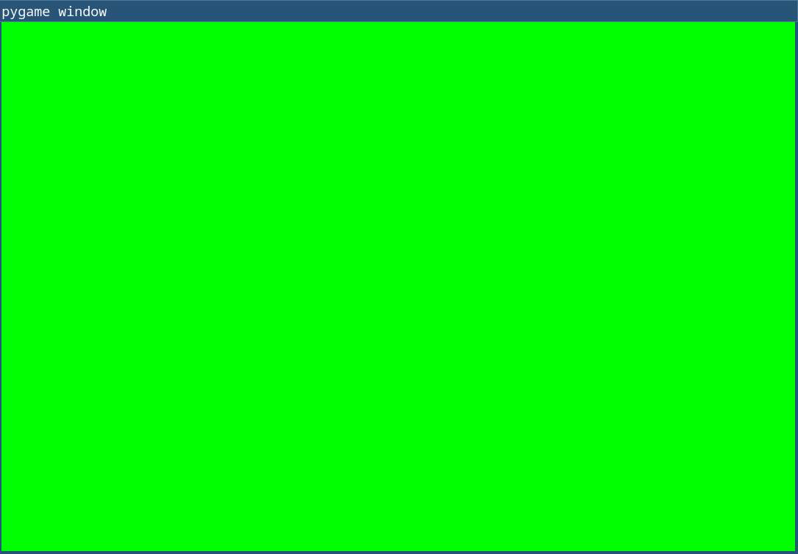
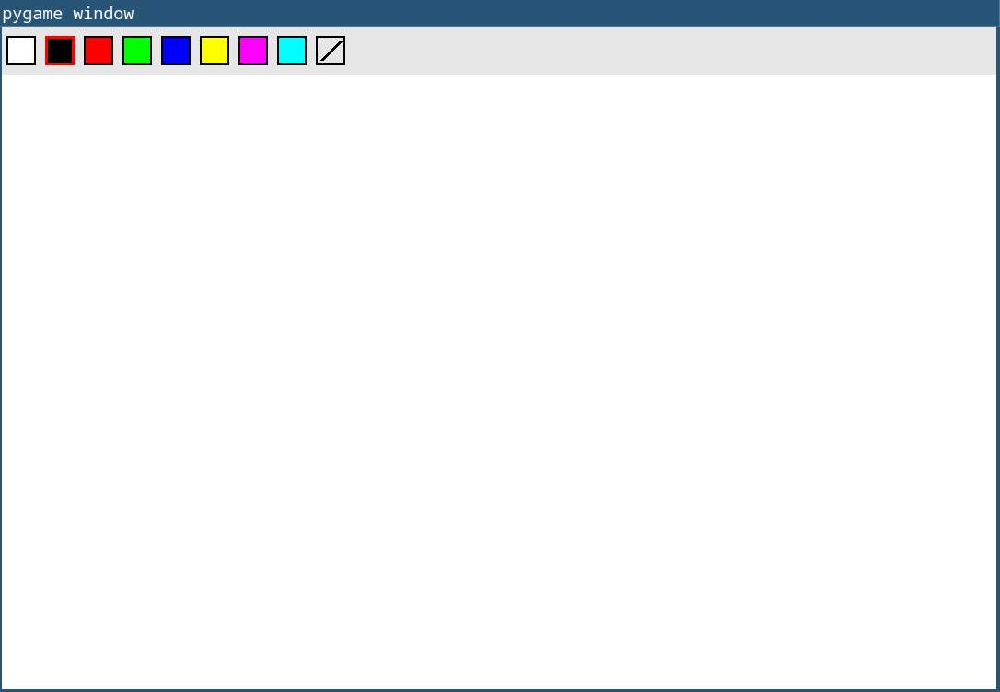
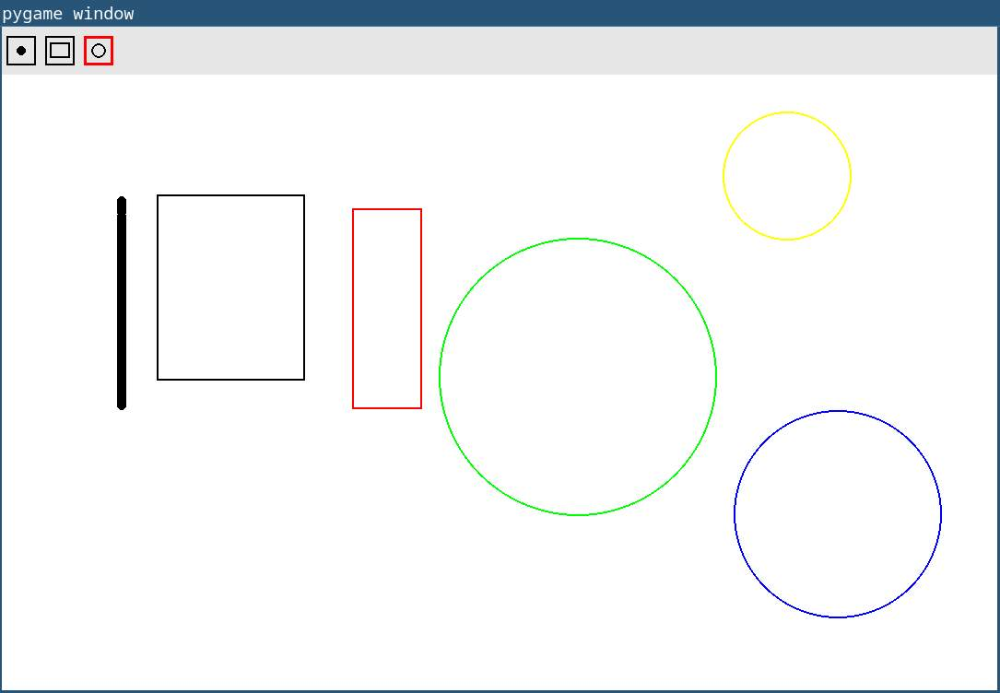

##  I. Introduction

Le roi Weegee, du royaume Mycélien a besoin de repeindre son château. Il est à la recherche
de nouveaux outils pour accomplir cette tâche ainsi que de main-d’œuvre.

À la suite de son appel d’offre, vous avez décidé de vous présenter à lui avec une idée
révolutionnaire, le Mycépaint. Cette idée consiste en un logiciel qui permettrait de dessiner les
contours des murs ainsi que les remplir de couleur. Weegee est tant enthousiaste par rapport
à votre idée qu’il disperse le reste des gens qui étaient venus se présenter.

Pour vous aider dans votre tâche, il vous appointe un assistant personnel, Regius. Il a
des écailles et pas de bras mais il est très sympa ! Il connaît les outils que vous allez utiliser. Il
va vous aider à mener votre projet à bien.

!pagebreak


## III. Une simple requête


Pendant les jours suivants votre entretien, le roi Weegee et vous vous baladez dans le
château. Il vous décrit ce qu’il aimerait pouvoir faire. D’abord, il prend un pinceau et gribouille
des formes sur le mur avec. Ensuite, il prend un seau de peinture et il le jette en disant qu’il
veut que le mur en soit recouvert jusqu’au plafond. Finalement, il empreinte une baguette
magique à son sorcier de compagnie et il tapote le mur avec, en vous disant qu’il veut pouvoir
repeindre complètement le mur dans sa couleur originale.

!pagebreak

### 1. En piste l’artiste !

La première tâche à effectuer dans la création de notre solution est de créer un
échafaudage pour dessiner sur notre toile.

Pour ce faire, Regius vous informe qu’il faut ouvrir une fenêtre et la rafraîchir régulièrement
à l’aide d’une boucle.

Une fois qu’elle est mise en place, il faut que vous puissiez en sortir. Regius vous propose
alors d’utiliser la touche « Echap » du clavier pour la fermer. Pour cela, vous allez utiliser le
système d’événement de clavier de Pygame.

A vous de réaliser cette magnifique fenêtre !

<center>*Voici une fenêtre que vous êtes censé avoir à la fin de cette étape*</center>

!pagebreak

### 2. Plusssssss de ligne !

Regius vous applaudit à la suite de votre réussite. Il vous dit ensuite que maintenant, il faut
dessiner des lignes !

Il feuillette son livre de référence et il vous rappelle qu’il faut utiliser plusieurs fonctions
dans Pygame :

* « Celle pour détecter le mouvement de la ssssssouris. »
* « Celle pour détecter si la souris est pressssée. »
* « Celle pour dessssssiner dans votre fenêtre. »

Notre reptile préféré se rappelle aussi que pour faire une belle ligne il faut tracer un trait
entre le point n-1 et le point actuel de la souris lorsque le clic gauche est activé.

N’oubliez pas de trouver et d’utiliser les bonnes fonctions décrites plus haut !

<center>*Voici un magnifique serp... LIGNE que vous pouvez faire à la fin de cette étape*</center>

!pagebreak

### 3. Plusssssss de couleurs !

Bravo ! Vous pouvez tracer une ligne noire ! Maintenant il faut penser à étendre votre
palette de couleurs disponibles.

Vous vous tournez donc vers votre cher assistant. Il vous informe qu’il faudra créer une
fonction qui s’occupera du changement de couleurs. Elle devra retourner 3 chiffres entre 0 et
255.

``` python
def pick_color(key):
    if (key == pygame.key.key_code('N')):
        return (BLACK)  #renvoie du noir
```

Pour gérer le changement de couleur, il vous conseille de lier les touches de votre clavier
à certaines couleurs :

* R rouge
* G vert
* B bleu
* J jaune
* M magenta
* C cyan

Il ressort son livre de référence et il vous dit qu’il y a des moyens de détecter les touches
actives. Il s’agit du même système que vous avez utilisé pour détecter « Echap » mais en
utilisant « unicode » au lieu de « key ».

<center>*Voici ce que vous pouvez faire avec le changement de couleur implémenté !*</center>

!pagebreak

### 4. Abracadabra, le mur est uni !

Le roi Weegee vous a dit qu’il souhaitait repeindre un mur entier en un seul clic pour avoir
un arrière-plan frais pour sa prochaine œuvre d’art ! Pour réaliser cette demande, Regius vous
dit qu’il faut simplement remplacer l’entièreté des couleurs du mur en un coup.

Le monarque désire aussi un moyen de tout effacer en une touche. Notre assistant écailleux
vous signale que c’est la même chose que ce que vous étiez en train de faire juste avant. Au
lieu de remplir l’arrière-plan dans la couleur que vous avez sélectionné, il faut le remplir avec
du blanc.

<center>*Voici ce que vous êtes capable de faire une fois cette étape finie !*</center>

!pagebreak

### 5. La barre magique des couleurs !

Le roi Weegee adore les couleurs et souhaite pouvoir changer facilement la teinte de ses murs. Regius vous propose d’ajouter une barre de sélection de couleurs en haut de la fenêtre pour rendre le choix plus intuitif.

Pour réaliser cette fonctionnalité :

- Dessinez une barre horizontale en haut de la fenêtre (par exemple, un rectangle gris clair).
- Placez dans cette barre plusieurs petits rectangles ou cercles, chacun représentant une couleur différente (rouge, vert, bleu, jaune, magenta, cyan, noir…).
- Lorsque l’utilisateur clique sur l’une de ces couleurs, la couleur de dessin active change immédiatement.
- Affichez aussi la couleur actuellement sélectionnée (par exemple, en l’entourant ou en l’agrandissant).
- Ajoutez un bouton « Effacer » (Clear) dans la barre, qui permet de remettre la toile à zéro d’un simple clic.

<center>*Voici une barre de couleurs avec un bouton "Clear" pour repartir d'une page blanche !*</center>

!pagebreak

### 6. La boîte à outils magique !

Le roi Weegee souhaite encore plus de créativité : il veut pouvoir dessiner non seulement des lignes, mais aussi des cercles et des rectangles ! Regius vous propose d’ajouter une boîte à outils (toolbox) pour choisir l’outil de dessin.

Pour réaliser cette fonctionnalité :

- Ajoutez une zone (par exemple, à gauche ou en haut de la fenêtre) affichant les icônes des outils disponibles : un pinceau (ligne libre), un cercle, et un rectangle.
- Lorsque l’utilisateur clique sur une icône, l’outil de dessin actif change (ligne, cercle, ou rectangle).
- Affichez l’outil actuellement sélectionné (par exemple, en le surlignant ou en l’agrandissant).
- Pour le cercle et le rectangle : l’utilisateur clique pour définir le point de départ, puis fait glisser la souris pour définir la taille et relâche pour dessiner la forme.
- Le pinceau fonctionne comme avant pour dessiner des lignes libres.

<center>*Voici une boîte à outils permettant de choisir entre pinceau, cercle et rectangle !*</center>

!pagebreak

## IV. Conclusion

Regius vous informe que toutes les demandes du roi ont été complétées et vous propose d’aller le lui montrer directement. En arrivant dans la salle du trône, vous sentez des parfums fruités. Lorsque vous franchissez la porte de la grande salle, vous découvrez un magnifique gâteau décoré de fraises et de framboises.

Le roi Weegee vous interpelle et vous annonce qu’il a suivi de loin votre projet et qu’il est très satisfait de votre travail. Pour vous remercier, il vous offre un trésor inestimable : une place permanente dans sa cour et le poste de conseiller technique royal.

En tant que nouveau conseiller du roi, vous pouvez continuer à améliorer Mycépaint avec vos propres idées, ou bien en choisir une parmi cette liste :

* Ajouter différentes tailles et formes de pinceaux.
* Créer un outil de remplissage de formes.
* Permettre la sauvegarde de vos œuvres d’art.
* *Et bien plus encore...*
