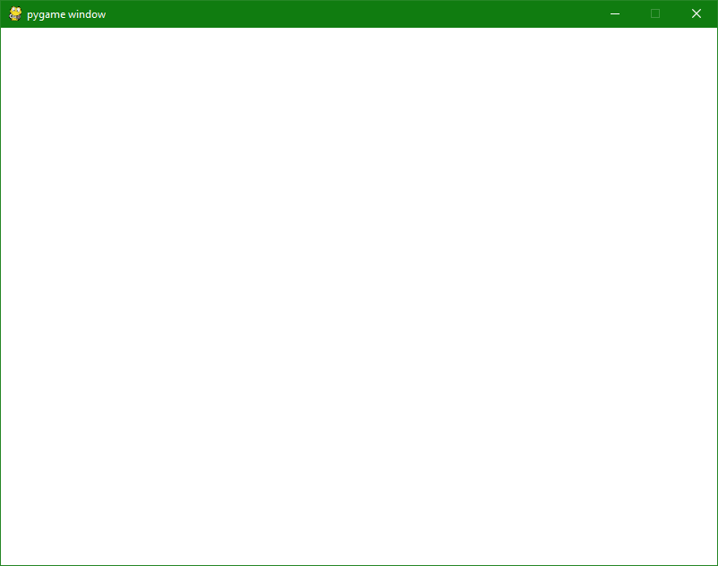
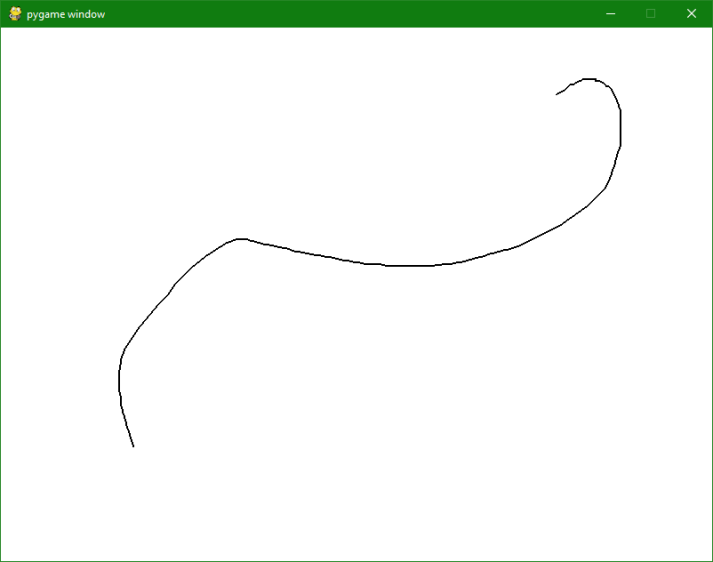
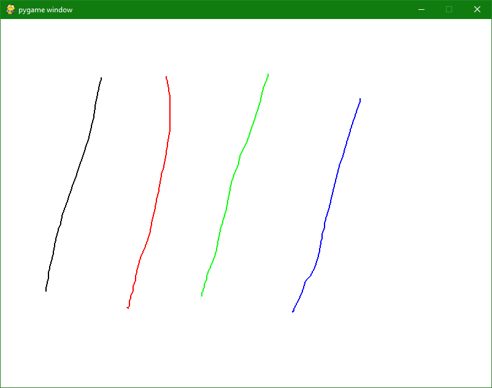
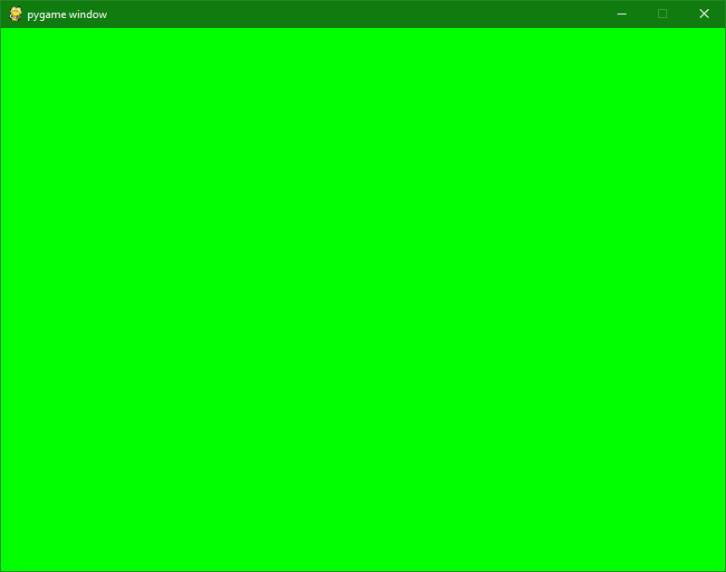

##  I. Introduction

Le roi Weegee, du royaume Mycélien a besoin de repeindre son château. Il est à la recherche
de nouveaux outils pour accomplir cette tâche ainsi que de main-d’œuvre.

À la suite de son appel d’offre, vous avez décidé de vous présenter à lui avec une idée
révolutionnaire, le Mycépaint. Cette idée consiste en un logiciel qui permettrait de dessiner les
contours des murs ainsi que les remplir de couleur. Weegee est tant enthousiaste par rapport
à votre idée qu’il disperse le reste des gens qui étaient venus se présenter.

Pour vous aider dans votre tâche, il vous appointe un assistant personnel, Regius. Il a
des écailles et pas de bras mais il est très sympa ! Il connaît les outils que vous allez utiliser. Il
va vous aider à mener votre projet à bien.

!pagebreak

## II. Consignes

* Vous avez tout à fait le droit d’utiliser internet pour trouver des réponses ou pour vous
renseigner.

* En cas de soucis ou questions demandez de l’aide à votre voisin de droite. Puis de gauche. Ou inversement. Puis demandez enfin à un cobra si vous êtes bloqué(e), un cobra se fera une joie de vous aider.

>:info !icon:circle-info Faite la prochaine étape seulement si vous n'êtes pas sur un PC du Coding Club.

* Veuillez suivre le tutoriel « Installation Python et ses outils ». Vous
aurez besoin d’installer la bibliothèque Pygame pour ce sujet.

  * Si l’installation ne se déroule pas bien, refaites l’installation de zéro.

!pagebreak

## III. Une simple requête


Pendant les jours suivants votre entretien, le roi Weegee et vous vous baladez dans le
château. Il vous décrit ce qu’il aimerait pouvoir faire. D’abord, il prend un pinceau et gribouille
des formes sur le mur avec. Ensuite, il prend un seau de peinture et il le jette en disant qu’il
veut que le mur en soit recouvert jusqu’au plafond. Finalement, il empreinte une baguette
magique à son sorcier de compagnie et il tapote le mur avec, en vous disant qu’il veut pouvoir
repeindre complètement le mur dans sa couleur originale.

!pagebreak

### 1. En piste l’artiste !

La première tâche à effectuer dans la création de notre solution est de créer un
échafaudage pour dessiner sur notre toile.

Pour ce faire, Regius vous informe qu’il faut ouvrir une fenêtre et la rafraîchir régulièrement
à l’aide d’une boucle.

Une fois qu’elle est mise en place, il faut que vous puissiez en sortir. Regius vous propose
alors d’utiliser la touche « Echap » du clavier pour la fermer. Pour cela, vous allez utiliser le
système d’événement de clavier de Pygame.

A vous de réaliser cette magnifique fenêtre !

<center>*Voici une fenêtre que vous êtes censé avoir à la fin de cette étape*</center>

!pagebreak

### 2. Plusssssss de lignes !

Regius vous applaudit à la suite de votre réussite. Il vous dit ensuite que maintenant, il faut
dessiner des lignes !

Il feuillette son livre de référence et il vous rappelle qu’il faut utiliser plusieurs fonctions
dans Pygame :

* « Celle pour détecter le mouvement de la ssssssouris. »
* « Celle pour détecter si la souris est pressssée. »
* « Celle pour dessssssiner dans votre fenêtre. »

Notre reptile préféré se rappelle aussi que pour faire une belle ligne il faut tracer un trait
entre le point n-1 et le point actuel de la souris lorsque le clic gauche est activé.

N’oubliez pas de trouver et d’utiliser les bonnes fonctions décrites plus haut !

<center>*Voici un magnifique serp... LIGNE que vous pouvez faire à la fin de cette étape*</center>

!pagebreak

### 3. Plusssssss de couleurs !

Bravo ! Vous pouvez tracer une ligne noire ! Maintenant il faut penser à étendre votre
palette de couleurs disponibles.

Vous vous tournez donc vers votre cher assistant. Il vous informe qu’il faudra créer une
fonction qui s’occupera du changement de couleurs. Elle devra retourner 3 chiffres entre 0 et
255.

``` python
def pick_color(key):
    if (key == pygame.key.key_code('N')):
        return (0, 0, 0) #renvoie du noir
```

Pour gérer le changement de couleur, il vous conseille de lier les touches de votre clavier
à certaines couleurs :

* R rouge
* G vert
* B bleu
* J jaune
* M magenta
* C cyan

Il ressort son livre de référence et il vous dit qu’il y a des moyens de détecter les touches
actives. Il s’agit du même système que vous avez utilisé pour détecter « Echap » mais en
utilisant « unicode » au lieu de « key ».

<center>*Voici ce que vous pouvez faire avec le changement de couleur implémenté !*</center>

!pagebreak

### 4. Abracadabra, le mur est uni !

Le roi Weegee vous a dit qu’il souhaitait repeindre un mur entier en un seul clic pour avoir
un arrière-plan frais pour sa prochaine œuvre d’art ! Pour réaliser cette demande, Regius vous
dit qu’il faut simplement remplacer l’entièreté des couleurs du mur en un coup.

Le monarque désire aussi un moyen de tout effacer en une touche. Notre assistant écailleux
vous signale que c’est la même chose que ce que vous étiez en train de faire juste avant. Au
lieu de remplir l’arrière-plan dans la couleur que vous avez sélectionné, il faut le remplir avec
du blanc.

<center>*Voici ce que vous êtes capable de faire une fois cette étape finie !*</center>

!pagebreak

## IV. Conclusion

Regius vous informe que toutes les demandes du roi ont été complétées, il vous propose
d’aller le lui montrer directement. En arrivant vers la salle du trône vous sentez des parfums
fruités. Lorsque vous franchissez la porte de la grande salle, vous découvrez un magnifique
gâteau décoré de fraises et de framboises.
Le roi Weegee vous interpelle et vous informe qu’il
a suivi de loin votre projet et qu’il est satisfait de votre travail. Pour vous remercier, il vous
récompense avec un trésor inestimable : une place permanente dans sa cour et le poste de
conseiller technique royal.

En tant que nouveau conseiller du roi, vous pouvez continuer le Mycépaint avec vos propres
idées, ou vous pouvez en prendre une dans cette liste :

* Des tailles et formes de pinceaux variés.
* Un outil de remplissage de formes.
* Un aperçu de la couleur actuelle et/ou de l’outil en cours d’utilisation.
* Optimiser la sélection des couleurs.
* La possibilité de sauvegarder vos œuvres d’art.
* *Et beaucoup plus encore...*
