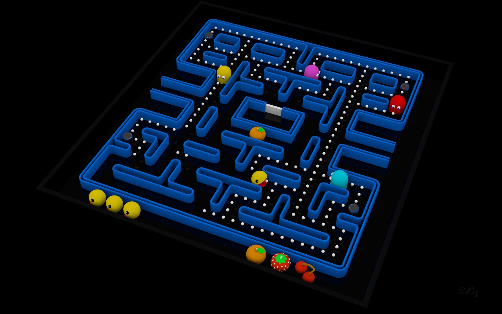

## Pacman :


*Illustration par PixelOz*

Le but de ce projet est de créer une version simplifiée du célèbre jeu Pacman.

Comme vous ne pouvez pas construire le jeu à partir de zéro en 2 heures, nous vous fournissons un code d'enrobage (a.k.a "Wrapper") qui vous permettra de vous concentrer sur la mise en œuvre de la logique du jeu.<br>
Le jeu sera rendu en utilisant Tkinter, mais vous n'interagirez pas directement avec lui.

## 1. Introduction :

### Prérequis :

- [Python](https://www.python.org/downloads/) installé
- [Pip](https://pip.pypa.io/en/stable/installing/) installé
- [Tkinter](https://tkdocs.com/tutorial/install.html) installé

### Objectifs :

- Découvrir les bases de la programmation orientée objet en Python
- Créer et manipuler des classes et des objets
- S'amuser !

### Test :

Comme j'ai manuellement supprimé des parties du code, l'exécution entraînera une erreur.<br>
Vous avez 2 choix :
- Corriger tout le code, puis lorsque vous pourrez l'exécuter, déboguez-le
- Modifier le code pour supprimer les appels des fonctions que vous n'avez pas encore corrigées, puis corrigez-les une par une

Les deux options sont bonnes, choisissez celle qui vous convient le mieux.

### Difficulté et communication :

Le sujet peut sembler ne pas vous donner beaucoup d'instructions, car votre objectif est de faire les recherches nécessaires pour comprendre le code et mettre en œuvre la logique du jeu par vous même.<br>
Ce projet n'est pas une évaluation, vous devez communiquer avec vos camarades de classe pour terminer le projet.<br>
Gardez à l'esprit que ce projet est difficile par conception, demandez à Google, demandez à vos camarades de classe, demandez-nous, mais n'abandonnez pas !

Ce projet comporte 2 niveaux de difficulté, choisissez celui qui vous convient le mieux :

- **Normal** : Vous devrez implémenter une partie de la logique du jeu ainsi que certaines fonctions de bibliothèque.
- **Difficile** : Vous devrez implémenter la quasi-totalitée de la logique du jeu.

**Bonne chance soldat !**

### 1.1. Variables et Types :

Comme vous le savez sûrement, Python utilise un système à typage faible. Cela signifie que vous n'avez pas besoin de déclarer le type d'une variable avant de l'utiliser. Le type d'une variable est déterminé par la valeur que vous lui attribuez.<br>
Cependant, il n'est pas recommandé d'utiliser cette fonctionnalité car cela peut entraîner des confusions et des bugs. C'est pourquoi je vous recommande toujours de déclarer le type de vos variables.<br>
Pour ce faire, vous pouvez utiliser la syntaxe suivante :

```python
nom_variable: type = valeur
```

Pour les fonctions, vous pouvez déclarer le type des arguments et la valeur de retour comme ceci :

```python
def function_name(arg1: type1, arg2: type2) -> return_type:
    pass
```

Même si Python ne forcera pas le type, cela vous aidera à comprendre votre code et à éviter les erreurs.<br>
Je vous recommande vivement d'utiliser cette fonctionnalité dans ce projet.

!pagebreak

## 2. Premiers pas :

Pour commencer le projet, vous devrez corriger les fichiers `main.py` et `library.py`.<br>
Ce sera une petite introduction au projet et au code que vous devrez écrire.
Des indications seront fournies dans les docstrings des fonctions.

### 2.1. `main.py` :

Ce fichier est le point d'entrée du projet. Il sera utilisé pour démarrer le jeu et interagir avec le joueur.

### 2.2. `library.py` :

Ce fichier contient certaines fonctions génériques qui ne correspondent pas à une classe précise.<br>
Il fournit également des classes utiles comme `Vector2D` et `BadFileException`.

>:info Si vous êtes déjà à l'aise avec la programmation orientée objet, vous pouvez directement passer au code.

#### 2.2.1. `Vector2D` :

Cette classe représente un vecteur 2D. elle sera utilisé pour représenter la direction des entités dans le jeu.<br>

Comme nous définissons un type personnalisé, nous devons définir des opérations dessus.<br>
En programmation orientée objet, cela s'appelle la surcharge d'opérateurs.<br>
Pour y parvenir en Python, vous pouvez utiliser la syntaxe suivante :

```python
def __add__(self, autre: Vector2D) -> Vector2D:
    # overload of the '+' operator
    pass
```

#### 2.2.2. `BadFileException`:

Cette classe est une exception personnalisée.<br>
Nous utilisons une exception personnalisée pour gérer des erreurs spécifiques qui peuvent survenir dans notre code.<br>

Cette classe nous montre un nouveau concept de POO : l'héritage.<br>
L'héritage est un moyen de créer une nouvelle classe qui réutilise les propriétés et méthodes d'une classe existante.<br>
En Python, vous pouvez hériter d'une classe comme ceci :

```python
class ParentClass:
    pass

class ChildClass(ParentClass):
    pass
```

Pour vraiment utiliser la classe parent, vous devez également appeler son constructeur 

```python
class ChildClass(ParentClass):
    def __init__(self):
        super().__init__()
```

`super()` Est une fonction qui retourne une instance de la classe parent.

>:warning Assurez-vous de bien comprendre cette partie avant de continuer. N'hésitez pas à poser des questions si vous n'êtes pas sûr.

!pagebreak

## 3. Le jeu:

>:success C'est maintenant que le fun commence !

Maintenant que vous avez corrigé la bibliothèque et que vous avez une meilleure compréhension de la POO, vous pouvez commencer à implémenter la logique du jeu.<br>

>:warning Cette partie est plus complexe que la précédente. N'hésitez pas à poser des questions si vous n'êtes pas sûr.

Dans cette partie, nous vous fournissons 3 classes.

### 3.1. `SpriteHandler`:

Comme indiqué précédemment, l'objectif de ce projet n'est pas que vous manipuliez Tkinter.<br>
Je vous encourage à lire la classe, mais vous n'aurez pas à la modifier (elle est déjà parfaite !).

Comme son nom l'indique, cette classe gérera les sprites du jeu.

### 3.2. `Entity`:

Cette classe représente une entité dans le jeu.<br>
Mis à part le booléen `is_player`, vous n'avez aucun moyen de savoir de quel type d'entité il s'agit.<br>
C'est le but de la classe `Entity` : être une classe générique qui peut être utilisée pour n'importe quel type d'entité.

Pour rendre le code plus lisible, le joueur a une méthode `move` personnalisée.

## 4. Bonus:

>:success Félicitations d'être arrivé jusqu'ici !

Mais le plaisir ne s'arrête pas là ! Vous pouvez ajouter plus de fonctionnalités au jeu.

Voici quelques idées :
- Ajouter plus d'entités (fantômes, fruits, ...)
- Ajouter un système de vies
- Ajouter un menu

Ce sont des idées de "gameplay", mais vous pouvez également améliorer le code :

### 4.1. représentation des entitées sur la map:

Actuellement, le jeu est uniquement représenté par une liste 2D (`game_map: list[list[str]]`), ce qui est simple, mais rudimentaire.<br>
Pour remédier à cela, voici deux idées :
- Créer une classe Map qui gérera la représentation des entitées sur la carte
- Supprimer la logique de la carte et utiliser Vector2D pour représenter la position des entités

### 4.2. AI:

L'IA actuelle du ou des fantômes est très basique et repose sur l'aléatoire.<br>
N'hésitez pas à ajouter une véritable IA au(x) fantôme(s) !<br>
Pour ce faire, voici quelques idées :
- Lorsqu'un fantôme voit le joueur, il le suit (simple, mais efficace)
- Implémenter un algorithme de recherche de chemin (pathfinding) qui suivra le joueur (difficile, mais gratifiant)

En parlant de recherche de chemin, voici quelques algorithmes que vous pouvez utiliser :
- A* (A-star)
- Dijkstra
- Recherche en largeur (Breadth-first search)
- Recherche en profondeur (Depth-first search)

Personnellement, je vous recommande le A*, c'est le plus efficace et le plus facile à implémenter, mais tous sont de bons choix avec des avantages et des inconvénients.

**Assez de lecture, allez vous amuser !**

## 5. Glossaire:

- **Wrapper**: Un morceau de code qui fournit une interface simplifiée à une bibliothèque ou un ensemble de code plus complexe.
- **POO**: Programmation Orientée Objet
- **Héritage**: Une façon de créer une nouvelle classe qui réutilise les propriétés et méthodes d'une classe existante.
- **Surcharge d'opérateurs**: Une façon de définir un comportement personnalisé pour un opérateur (comme +, -, *, ...).
