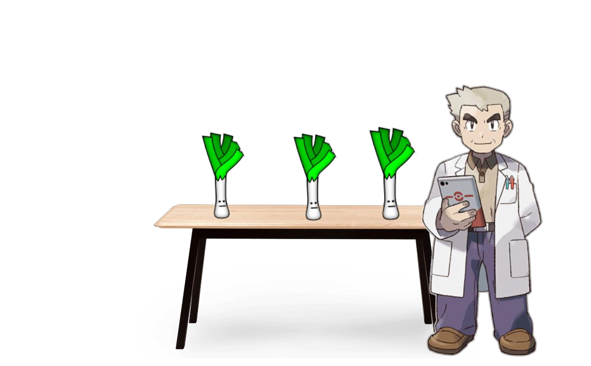
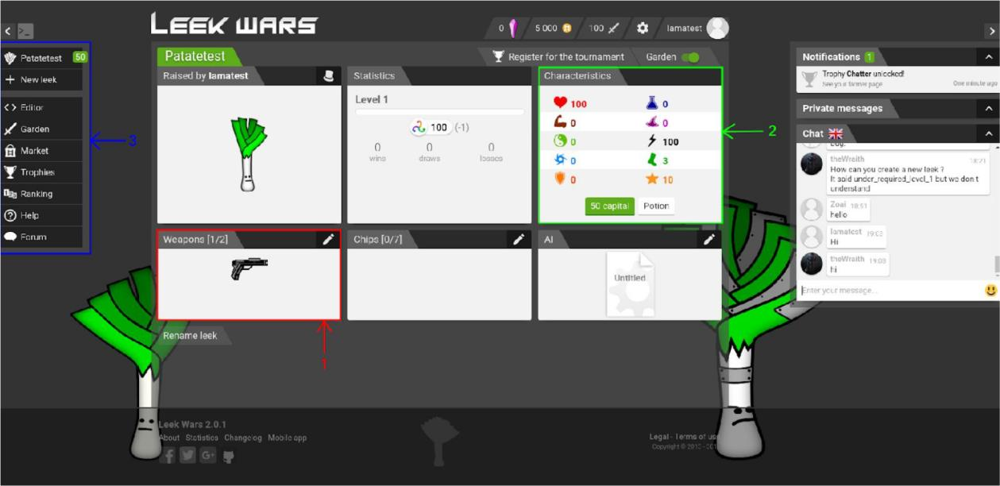
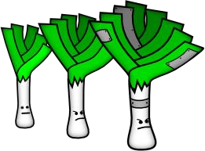
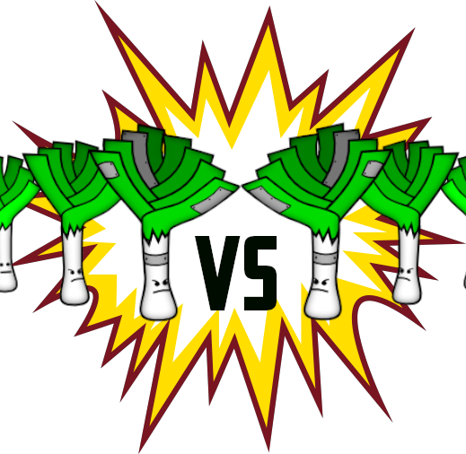
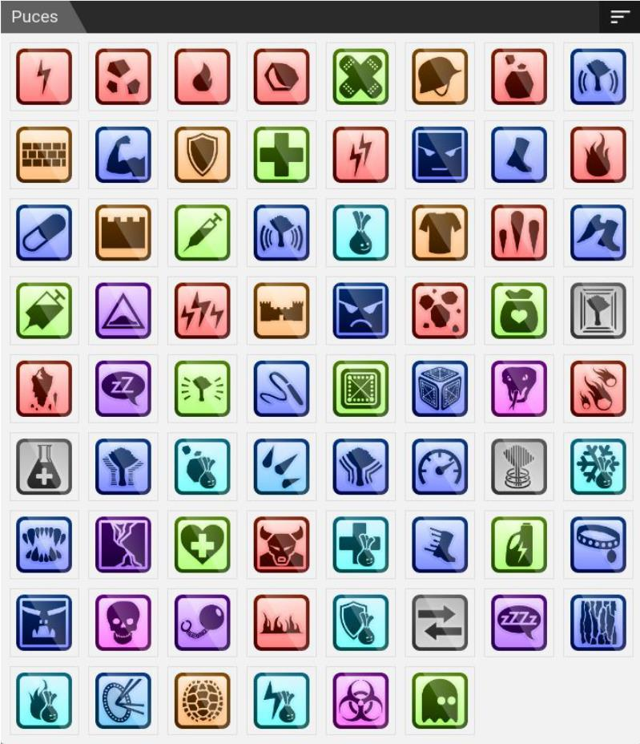
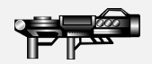
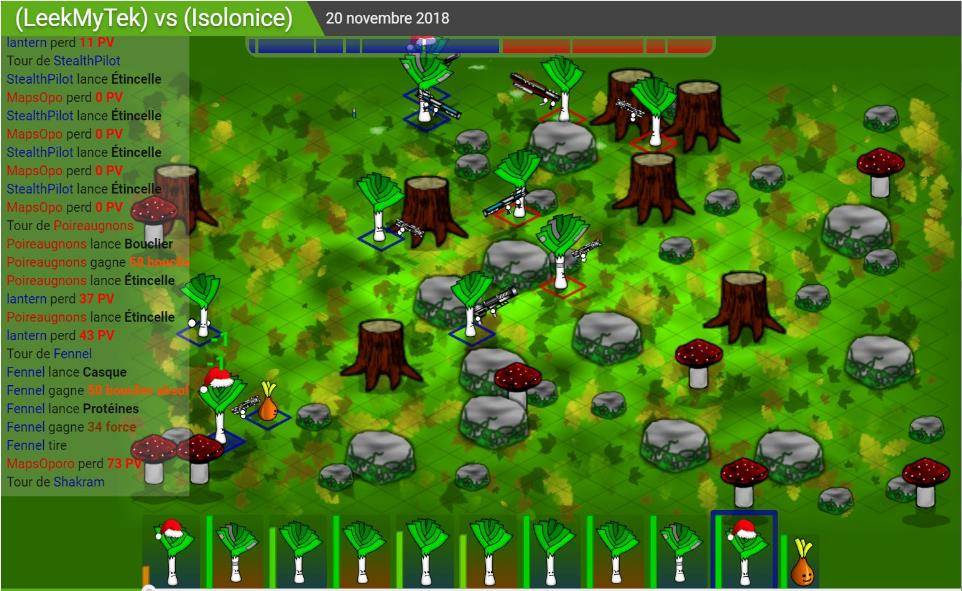

<div style="text-align:justify">

## I. Introduction

Bienvenue dans l’univers de Poképoireau.

Bravo à vous jeunes dresseurs, vous avez été appelé par le professeur Chêne pour choisir votre tout
premier poireau. Il a décidé que vous êtes désormais prêts à entamer votre quête à travers le pays, et
affronter tous les autres dresseurs, dans le but d’obtenir le titre de « Maître Poireau » tant convoité.
Avant d’arriver à cela, vous allez devoir entrainer votre petit protégé, lui apprendre les meilleures
techniques de combat et l’encourager pour l’aider à devenir de plus en plus fort.


<center>*Choisissez bien, il va vous accompagner toute votre vie !*</center>

!pagebreak

## II. Consignes

* Vous avez tout à fait le droit d’utiliser internet pour trouver des réponses ou pour vous
renseigner.

* Pour ce projet-là, il vous est demandé de choisir comme nom du repository : PokePoireau_cc.
Si vous ne savez pas utiliser git allez lire le tutoriel « Le coffre a jouet du petit git ».

* En cas de soucis ou questions demandez de l’aide à votre voisin de droite. Puis de gauche. Ou inversement. Puis demandez enfin à un cobra si vous êtes bloqué(e).

!pagebreak

## III. Un jour je serai le meilleur dresseur

### 1. Il n'y a pas de champion sans entrainement

!linebreak

En effet, Il va falloir travailler dur pour arriver tout en haut et devenir le plus fort ! Pour cela le professeur Chêne a créé un site internet en ligne pour que vous puissiez entrainer à distance votre petit poireau.

Commencez par créer un compte à cette adresse : https://leekwars.com/ . Si besoin est, vous pouvez passer le site en français ou en anglais. Connectez-vous avec votre compte Github ou votre adresse mail. Si vous choisissez cette dernière solution, vérifiez bien votre boite pour valider votre compte.

LeekWars est un site dont le but est de créer votre Intelligence Artificielle pour qu'elle combatte contre les IA des autres joueurs. Votre but est ainsi de créer l'IA la plus adaptive. Pour ce faire, différentes armes, compétences et sorts sont disponibles.

!linebreak

<center></center>
<center>*Voici le profil de votre poireau, ici vous pouvez y observer la moindre de ses caractéristiques*</center>

!linebreak

Dans l’image ci-dessus vous pouvez voir différents blocs de couleur accompagnés d’un numéro dans le but de vous expliquer un peu l’interface.

En 1, vous avez les objets équipés, vous pouvez voir que dans la case armes se trouve le pistolet de base.

En 2, ce sont les caractéristiques, il s’agit de vos capacités telles que votre vie, votre force, la fréquence à laquelle vous aurez la chance de débuter le combat, vos points d’actions (TP), etc.
N’oubliez pas d’attribuer des points à ces différentes stats lorsque vous passez un niveau, afin de
rendre votre poireau plus performant.

!pagebreak

En 3 se situe votre Menu qui contient plusieurs possibilités :

- Éditeur, permet de modifier l’IA de votre poireau.
- Potager, pour combattre d’autres poireaux.
- Marché, afin d’acheter des armes ou des sorts.
- Équipe, pour y accéder quand vous en aurez une.
- Trophée, c’est ici que vous pourrez consulter vos différents objectifs atteints.
- Classement, comparez-vous aux autres joueurs du monde !
- Aide, pour accéder à des tutoriels et la documentation.
- Le forum pour parler et échanger avec la communauté.

En 4 vous pouvez consulter directement l’IA active sur votre poireau. Comme vous le savez, un jeune poireau débutant ne sait pas trop quoi faire pour gagner contre ses adversaires, il compte sur vous pour l’aider et le guider dans ses actions lors d’un match. C’est ici que L’IA va intervenir ! Une IA (Intelligence Artificielle) est un programme qui s’adapte et répond de façon différente en fonction d’un cas donné. L’exemple le plus concret est l’assistant artificiel que l’on retrouve dans tous les téléphones comme Google assistant, Siri, Microsoft AI...

En 5 lorsque que vous en aurez, vous pourrez acheter des sorts !

!linebreak

<center></center>
<center>*Petit poireau deviendra grand !*</center>

!pagebreak

### 2. Partez du bon pied

Commençons par voir certaines notions de base en programmation.
La première ? Les variables !

Qu’est-ce qu’une variable ?

Une variable sert à stocker une donnée, un nombre, une chaîne de caractère ou plein d’autres types comme des nombres à virgules, etc... Vous pouvez simplement stocker des informations afin de les modifier et les réutiliser plus tard ! Si le joueur se déplace de 4 cases par exemple, cela permet dans un premier temps de garder l’emplacement de votre personnage dans une variable, puis par la suite, de modifier sa valeur. Pour créer une variable en LeekWars, il suffit de l’écrire comme ceci :

```js
var position = 1; 
```

Ensuite vous ajoutez 4 à cette variable :

```js
poition = position + 4;
```

Ensuite, pour afficher du texte ou une variable, il faut appeler une fonction. Une fonction est un
bout de code qui est entouré d’accolades « {} » et tout ce qui se trouve à l’intérieur sera exécuté
lorsque vous l’appellerez. Dans Leek Wars, cela ressemble à ceci :

```js
function moveforward() {

}
```

Cela sert à plusieurs choses : premièrement, à éviter de copier du code qui fait la même chose, mais également à rendre le code plus lisible ou plus générique.

<center></center>
<center>*On peut dire que votre poireau est un sacré rigolo !*</center>

!pagebreak

## IV. L’IA est votre plus grande force

### 1. Il est important de bien connaître son élève

Votre nouvel ami poireau possède déjà quelques bases en matière de combat, mais elles sont très simples et sans votre aide il n’arriva malheureusement pas à progresser.

Allez dans l’éditeur. Vous trouverez un code généré par défaut. Pour le comprendre, vous devez l’observer. Chaque tour, votre poireau va exécuter le code ligne par ligne, dans le sens de lecture. Voici à quoi ressemble la première ligne : 

```js
// Take the pistol
setWeapon(WEAPON_PISTOL); // Warning: cost 1 TP
```

Comme écrit dans les commentaires, qui est la ligne commençant par «//», ce code définit l’arme en main, ici WEAPON_PISTOL. Chaque action coûte des TP (points de tir), dont le nombre varie selon les statistiques de votre poireau. Il est donc inutile d’équiper votre arme à chaque tour, vous le verrez par la suite.

```js
// Get the nearest enemy
var enemy = getNearestEnemy();
```

Cette ligne définit une variable appelée «enemy» qui prend la valeur que «getNearestEnemy» lui envoie. Cette valeur correspond à l'identifiant du poireau le plus proche du nôtre. Qui dans le cas en 1v1, est un ennemi. Par la suite, vous pourrez attaquer l’adversaire en utilisant son ID.

```js
// Move towards him
moveToward(enemy);
```

Ici, votre programme fait avancer votre poireau avec « move » vers l’ennemi désigné précédemment.

Vous allez ajouter vos premières modifications à ce code ! Créez une condition signifiée par «if» afin de récupérer le nombre de tours passés et sortir votre arme uniquement si ce dernier est égal à 1: 

```js
// Take the pistol
if (getTurn() == 1) {
	setWeapon(WEAPON_PISTOL);
}
```

Pour tester votre programme, soit vous pouvez utiliser le bouton tester et créer un scenario contre Domingo qui est un poireau de votre niveau, soit vous pouvez affronter des inconnus dans potager. 

!pagebreak

### 2. Hop, hop, hop faut que ça bouge !

Que diriez-vous d’améliorer les déplacements de votre ami ? Histoire qu’il puisse réagir lorsque se passe un évènement précis. Commencez par changer la façon dont se déplace le poireau afin de diversifier ses mouvements. Vous pouvez le faire reculer, aller à gauche ou à droite lorsqu’il est touché par l’adversaire. Ainsi, ajoutez une action qui va vous permettre d’avancer de 2 et de reculer de 1 : 

```js
// Move towards him
moveToward(enemy,2);
// Try to soot him
useWeapon(enemy);
// Move away
moveAwayFrom(enemy, 1);
```

Vous pouvez par exemple, pour approfondir, déplacer votre poireau derrière un obstacle afin de vous protéger, ou encore amener l’ennemi dans un endroit fermé pour le bloquer.

### 3. Bang bang !!

Vous avez vu au tout début que votre poireau ne tirait qu’une fois par tour et dépense trois TP. Maintenant tentez d’asséner plusieurs coups à l’ennemi avec votre arme. Pour cela, vous allez avoir besoin de connaître vos TP, c’est là que la fonction « getTP() » entre en jeu. Comme son nom l’indique, elle récupère les TP d’un poireau ; ce qui permet d’analyser la situation et de réagir en conséquence.

```js
// Try to shoot him!
var my_tp = getTP();
```

Désormais votre poireau aura un petit plus comparé à l’IA de base. Et votre ennemi n’aura plus qu’à déguster vos tirs à chaque tour. Cependant, faites attention à vos TP: votre arme en utilise un certain nombre, de l’ordre de 3 pour l’arme de base, ainsi si vous essayez de tirer mais qu’elle n’en a pas assez, votre IA va tourner en boucle sur cette partie du code et donc finir par timeout, c’est à dire que la lecture du code ne s'arrêtera pas et que les actions prévues à la suite ne seront pas réalisées.

C’est pourquoi il est conseillé de mettre dans votre condition, qui est la boucle «while», «my_tp > [ nombre de TP utilisé par votre arme ]» au lieu de «my_tp > 0». Ci-dessous vous avez l’exemple d’un code qui fonctionnera sans soucis !

```js
// Try to shoot him!
var my_tp = getTP();
var shoot = USE_SUCCESS;
while(my_tp >= 3 and shoot != USE_INVALID_POSITION) {
	shoot = useWeapon(enemy);
	my_tp = getTP();
}
```

!pagebreak

### 4. La distanciation sociale est la clé !

Pour améliorer vos déplacements, il faut pourvoir prendre en compte la distance entre votre champion et votre adversaire. Tout d’abord, récupérez votre position et la position de l’ennemi. Pour cela utilisez la fonction «getCell». Entrez le code suivant :

```js
var pos_enemy = getCell(enemy);
var pos_player = getCell();
```

>:warning !icon:triangle-exclamation Votre position (Cell) ne correspond pas à votre ID !

Afin de vous développer, vous pouvez également prendre en compte la distance entre vous et votre ennemi. Pour ce faire, utilisez la fonction «getCellDistance» : celle-ci prend en paramètres deux positions, la vôtre et celle de votre adversaire. 

```js
var dist = getCellDistance(pos_player, pos_enemy);
```

Maintenant que c’est fait, vous pouvez utiliser cette nouvelle donnée pour vous mettre à couvert, aller à portée de tir, planifier vos déplacements afin de prendre l’avantage !

<center></center>
<center>*C’est l’heure du dudududuel !*</center>

!pagebreak

## V. Les pouvoirs incroyables du poireau :

Super, bien joué ! Votre progression est fulgurante, et votre poireau plus efficace ! Vous avez eu l'occasion de voir l’utilisation des armes, les mouvements... Mais avez-vous pensé à vous soigner ? À utiliser de la magie pour attaquer votre adversaire de plus loin ? C’est possible grâce aux puces que vous pourrez acheter en magasin : 

!linebreak

<center></center>
<center>*Les possibilités sont infinies, choisissez bien vos pouvoirs !*</center>

!pagebreak

### 1. Rafistolez le poireau

Votre valeureux compagnon peut subir des dégâts, vous allez devoir anticiper tout ça, pour optimiser vos combats. Pour pouvoir effectuer cela, il est nécessaire d’avoir atteint le niveau 3, donc n’hésitez pas à affronter vos voisins, ou des inconnus pour augmenter votre expérience. Après cela, vous pourrez acheter la puce CHIP_BANDAGE : 

<center></center>
<center>En effet, c’est un pansement !</center>

!linebreak

Vous pouvez désormais la mettre sur votre poireau. Pour cela allez sur l’onglet principal de votre poireau et équipez-la. Une fois que c’est fait, codez la partie permettant de l’utiliser. Essayez de suivre la logique suivante pour la rajouter à votre IA : s’il vous manque de la vie, alors utilisez la puce de soin.

```js
// health
var Life = getTotalLife();
var life_now = getLife();
var my_leek = getEntity();

if(life_now < Life) {
	useChip(CHIP_BANDAGE, my_leek);
}
```

Votre légume peut maintenant se soigner ! Vous pourrez résister plus longtemps sous le feu ennemi. Vous pouvez aussi utiliser les puces de protection, qui serviront à prévenir les blessures. 

!pagebreak

### 2. Déterrez le poireau adverse

Parfait ! Vous commencez à devenir un véritable professionnel. Maintenant améliorez vos attaques en utilisant des sortilèges pour donner une bonne raclée aux ennemies ! Pour commencer à utiliser les sorts d’attaques à distance, vous devez commencer par acheter l'une des puces offensives, qui sont représentées par la couleur rouge.

<center></center>
<center>*Voilà votre sort !*</center>

Comme vous pouvez le voir à côté de la puce, vous avez ici plusieurs infos à propos de celle-ci tel que sa portée, les TP nécessaires pour l’utiliser ou encore les dégâts qu'elle inflige. Pour cette dernière la portée est de 0 à 6 blocs, 2TP sont nécessaires pour l'utiliser et elle fait de 5 à 7 dégâts par utilisation.

L'une des premières utilisations que vous en aurez sera : 

```js
// Use Chip_Shock
useChip(CHIP_SHOCK, enemy);
```

Ici, vous ne faites qu’utiliser le sort Shock sur l’adversaire. Maintenant améliorez votre algorithme pour activer la puce si la portée de votre arme est inférieure à votre distance à l'ennemi ET que la portée de votre puce est supérieure ou égale à votre distance à l'ennemi.

### 3. Petit tour à l’armurerie

Que diriez-vous de passer à la vitesse supérieure ? Après tous vos combats, vous devriez pouvoir acheter une nouvelle arme. Le MACHINE_GUN est une arme de départ de choix pour cette nouvelle expérience. Pour l’équiper faites comme pour les chips. Voyons maintenant comment l’utiliser.

<center></center>
<center>Voici l’incroyable MACHINE_GUN</center>

Vous avez déjà des fonctions utilisant l’arme. Mais comment en changer ? Utilisez le même principe que pour le tout premier pistolet que vous aviez :

```js
// Change our weapon
setWeapon(WEAPON_MACHINE_GUN);
```

Vous pouvez maintenant ajouter une condition afin de choisir quand sortir l’arme et ne pas dépenser 1 TP à chaque nouveau tour.

!pagebrak

## VI. Découvrez le manuel du savoir ultime

Vous commencez à devenir un expert, le professeur Chêne n’a plus rien à vous apprendre. L’élève a dépassé le maître ! Désormais, vous allez devoir faire vos propres recherches et expériences pour augmenter votre niveau.

Mais vous avez de la chance ! Une documentation est fournie par le site. Vous y trouverez toutes les fonctions que vous n’avez pas vu pour l’instant. Il y aura aussi des informations sur comment réaliser les IA si vous voulez d’autres idées pour votre poireau. Cette partie se trouve dans la partie aide du site. Vous y trouverez les informations sur les différentes fonctions qui existent et que vous pouvez utiliser. Pour cela, vous devez sélectionner la fonction que vous désirez : vous saurez alors quels sont ses paramètres et ses retours. Have fun !

<center></center>
<center>*Il va falloir lire tout ça à votre poireau, tout le monde sait qu’ils ne savent pas lire.*</center>

!pagebreak

## VII. Toujours plus loin, toujours plus haut, toujours plus fort !

Votre entrainement prend fin, vous avez beaucoup évolué depuis que vous avez récupéré votre poireau. On sent bien à quel point vous êtes liés désormais, vous êtes devenus inséparables ! Le professeur tient à vous féliciter une dernière fois avant que vous partiez dans de folles aventures.

Si vous souhaitez aller plus loin, il vous a concocter une petite liste de choses à réaliser :

- Personnaliser votre poireau !
- Augmenter votre niveau et améliorer vos pouvoirs.
- Créer une équipe avec vos amis en cliquant sur votre profil pour s’entrainer tous ensemble !

Bon courage à toi jeune poireau !

<center></center>
<center>*Constitue une équipe avec tes amis et soyez les meilleurs !*</center>