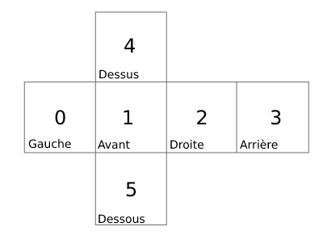
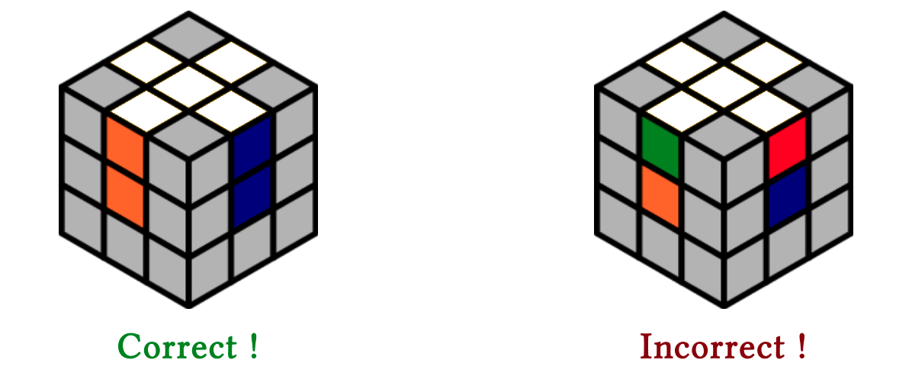
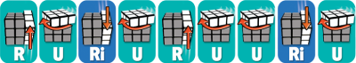
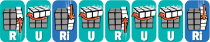
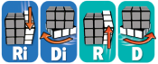
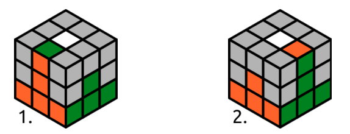
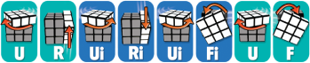
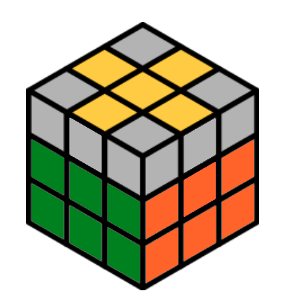
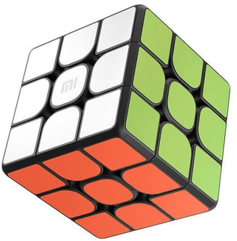

## I. Introduction

En 1989, Viki est une jeune hongroise passionnée de Rubik’s cube. Depuis quelques années, elle se lasse des tournois, survolant l’adversité à chaque fois. Elle a alors l’idée de créer un programme qui résout les fameux cubes contre lesquels elle pourrait s’entraîner. En effet, Viki a découvert la programmation quelques semaines auparavant et elle aura besoin de ton aide pour réussir son projet et faire fonctionner son code.


## II. Le programme

Ce sujet est à réaliser en **ruby**, un langage orienté objet open-source. Avec lui, on va pouvoir comprendre comment créer une **classe** et lui ajouter des **méthodes**.

_L'architecture des fichiers est déjà donnée._

On lancera notre programme grâce à la commande :

```sh
ruby algo.rb
```

>:warning !icon:triangle-exclamation Le programme fonctionne grâce à la librairie Colorize, si elle n'est pas installée sur l'ordinateur, vous pouvez le faire avec la commande `gem install colorize`


## III. Récupère le cube !

Commence par regarder les fichiers « .txt » dans le dossier **"cubes"**. C’est comme cela que seront stockées les faces des Rubik’s Cubes. 

Pour récupérer le Rubik's Cube, tu vas devoir créer une Classe qui va l'accueillir. Ta classe contiendra ton cube et des fonctions qui te permettront d'en faire tourner les faces.

Dans le fichier `rubic.rb` déclare une classe comme ceci :
```rb
class Rubic < Cube
end
```

>:info !icon:circle-info Le `< Cube` permet de récupérer des fonctions préparées à l'avance et de les ajouter à ta classe.

Tu peux maintenant charger un premier Rubik's Cube dans `algo.rb` en écrivant :
```rb
ru = Rubic.new("chemin/vers/rubikscube.txt")
```

!pagebreak

**Ton cube est stocké dans un liste,** ses faces sont numérotées comme ceci :



Le Rubik's Cube sera stocké comme une liste de faces.

Une face est stockée comme ceci :

```rb
[
	[0, 0, 0],
	[0, 0, 0],
	[0, 0, 0]
]
```

>:info !icon:circle-info `ru.get_rubic` permet d'accéder à une copie de cette liste pour vérifier la position des cases par exemple.

## IV. Crée le mouvement U et Ui.

### 1. Crée le mouvement U

Le mouvement U consiste à déplacer la ligne supérieure du cube dans le sens horaire.

La fonction `rotate_inface`, déjà existante, pourra t'être utile, elle permet de tourner une face dans le sens horaire mais ne tourne pas ses arêtes...

Pour tourner les arêtes :

La **ligne 0** de la **face 0** prendra la valeur de la **ligne 0** de la **face 1**.

La **ligne 0** de la **face 1** prendra la valeur de la **ligne 0** de la **face 2** etc.

Ajoute une méthode "u" à ta classe comme ceci :
```rb
class Rubic < Cube
	def u
		# Code
	end
end
```

>:warning !icon:triangle-exclamation **Attention** à ne pas dupliquer des lignes de ton Rubik's Cube !

### 2. Crée le mouvement Ui

Maintenant que tu as réussi la rotation U, tu peux faire le mouvement inverse, le mouvement Ui.

Tu as deux manières de le faire, soit tu fais l’inverse de ce que tu as fait précédemment, soit tu fais 3 fois la rotation U.

> Et oui, faire quatre fois la même rotation c’est comme ne rien faire !


## V. Résous la face blanche du Rubik’s Cube.

>:info !icon:circle-info Les autres méthodes de rotation du Rubik's Cube sont déjà implémentées.

**À partir d’ici, on va travailler dans le fichier `algo.rb`.**

### 1. Monter la face blanche

Pour résoudre un Rubik's Cube, on doit le prendre en main correctement. Pour ce faire, on va devoir le tourner dans tous les sens jusqu'à ce que la face blanche soit en haut.

Crée une fonction `def monter_face_blanche(ru)` qui ramènera la face blanche du cube au-dessus, peu importe la configuration de départ.

Pour ceci, tu peux utiliser les méthodes `ru.transform_left`, `ru.transform_right`, `ru.transform_up` et `ru.transform_down` qui permettent de tourner le cube dans toutes les directions.

Avec cette première fonction, on peut commencer la résolution de notre cube.

On va l'appeler puis afficher notre cube après transformation dans la fonction "algo".

```rb
def algo(ru)
	monter_face_blanche ru
	print " ----  Monter Face Blanche ----\n", ru
end
```

!pagebreak

### 2. Croix blanche

La première étape de la résolution d'un Rubik's Cube, est de former une croix sur la face blanche. La croix est bonne à condition que les arêtes soient de la couleur de leur face.

Exemple :



Si les 4 arêtes ne sont pas bien placées à l’origine, au moins 2 d’entre elles le seront forcément.

Une fois qu’on les a trouvées il faut appliquer l’une des 2 formules possibles, en fonction du cas de figure :

La fonction `def aretes_adj(ru)` sera appelée si les 2 arêtes bien placées se situent sur des faces adjacentes. Voici la formule à appliquer :



La fonction `def aretes_opp(ru)` quant à elle sera appelée si les 2 arêtes sont situées sur des faces opposées. Applique la suite ci-dessous pour résoudre la face.



**À toi de créer ces fonctions !**

Elles vont être utilisées dans la fonction **"croix_blanche"** qui se trouve dans le fichier `resol.rb`.

!pagebreak

On peut à nouveau appeler cette fonction dans notre fonction algo, comme pour **"monter_face_blanche"**.

```rb
def algo(ru)
	monter_face_blanche ru
	print " ----  Monter Face Blanche ----\n", ru
	croix_blanche ru
	print " ----  Croix Blanche ----\n", ru
end
```

>:warning !icon:triangle-exclamation **Attention** Si tu n’obtiens pas la croix blanche, reprend l’étape précédente ou demande l’aide d’un Cobra.

### 3. Coins blancs
Maintenant on va placer correctement les coins blancs.

La formule pour placer un coin est la suivante :



Crée la fonction `def serie_coins(ru)` qui exécute cette série.

Cette fonction sera appelée par la fonction **"coins_blancs"** qu'on exécutera de la même manière que **"croix_blanche"** dans notre fonction **"algo"**.

## VI. La deuxième couronne.

Maintenant que tu as réussi à résoudre une face, il faut résoudre les autres !

L’étape suivante consiste à constituer la « deuxième couronne » : la ligne du milieu du cube.

Il faut, une nouvelle fois, appliquer une suite de mouvements dans la fonction `def deuxieme_couronne(ru)`, mais attention, il y a deux cas différents.



La **situation 1** peut se traduire par :

- Le milieu de la première ligne de la face 1 est de la même couleur que le milieu de la face 1<br>**et**<br>Le milieu de la dernière ligne de la face 4 est de la même couleur que le milieu de la face 2

**ou**

- La case de droite de la ligne centrale de la face 1 est de la même couleur que le milieu de la face 2<br>**et**<br>La case de gauche de la ligne centrale de la face 2 est de la même couleur que le milieu de la face 1

**Dans ce cas-là,** on réalise la série suivante :



La **situation 2** peut se traduire par :

- Le milieu de la première ligne de la face 1 est de la même couleur que le milieu de la face 1<br>**et**</br>Le milieu de la dernière ligne de la face 4 est de la même couleur que le milieu de la face 0

**Dans ce cas-là,** on réalise la série suivante :


!pagebreak

On va créer cette fonction ensemble en complétant le code ci-dessous:

```rb
def deuxieme_couronne(ru)
	r = ru.get_rubic

	until is_2couronne_correct? r
		for i in 0..3
			if (situation1)
        		# actions situation 1
			elsif (situation2)
  				# actions situation 2
		end
		ru.ui
	end
	ru.transform_right
	end
end
```

Il ne reste plus qu'à créer les conditions et effectuer les bonnes actions !

>:warning !icon:triangle-exclamation Cette partie est un peu complexe, n'hésite pas à solliciter l'aide d'un Cobra.

On va maintenant retourner horizontalement notre Rubik's Cube pour que la face jaune se retrouve en haut et appeler notre fonction **"deuxieme_couronne"** dans la fonction **"algo"** :

```rb
ru.transform_down 
ru.transform_down
deuxieme_couronne ru
print " ----  2e Couronne ----\n", ru
```

## VII. La croix jaune.

L’étape suivante consiste à reformer la croix jaune.

La fonction "croix_jaune" du fichier `resol.rb` va avoir besoin d'une série d'actions.

On va l'écrire dans la fonction `def serie_croix_jaune(ru)`

Cette série d'actions consiste à :

- Abaisser la face de droite
- Tourner la face du haut dans le sens anti-horaire
- Tourner la face avant dans le sens anti-horaire
- Faire les mêmes mouvements dans l'autre direction et dans l'ordre 2-3-1



## VIII. Les coins jaunes.

Dans cette étape, il va falloir placer correctement les coins jaunes sur notre Rubik’s Cube.

On va compléter la fonction ci-dessous :

```rb
def coins_jaunes(ru)
	r = ru.get_rubic

	# Verification 1

    if coins_bien_places(r)
		# Code 1
	else
		# Code 2
	end
end
```

On va commencer par créer une fonction `def placement_formule(ru)` qui va exécuter une série d'actions qui nous sera utile pour la suite de notre fonction **"coins_jaunes"**.

La série d'actions est juste ici :

```
!icon:arrow-left 3 (!icon:arrow-right 23)	x u xl ol x ul xl o
```

_À vous de la déchiffrer..._

!pagebreak

### Revenons à notre fonction "coins_jaunes"

Dans un premier temps, il va falloir tourner le cube jusqu'à avoir le coin d'en haut à droite bien placé.

Si après 4 tours, on ne trouve toujours pas de coin bien placé, on applique notre fonction **"placement_formule"** et on rappelle notre fonction **"coins_jaunes"**.

>:info !icon:circle-info La fonction **"coins_bien_places"** indique si TOUS les coins sont bien placés (Ça peut sembler fou mais je vous jure que c'est vrai).<br><br>À l'inverse, la fonction **"premier_coin_bien_place"** va vérifier seulement le coin en haut à droite de la face.

**Si on a trouvé un coin bien placé :**

- Appeler **"placement_formule"**
- S'il reste des coins mal placés
	- Rappeler **"placement_formule"**

>:success !icon:check Pensez à appeler votre nouvelle fonction dans **"algo"**.

## IX. Tourner les coins jaunes.

Vous avez bien travaillé, cette fonction-là elle est **cadeau** ! 

Vous allez juste devoir retrouver son nom dans le fichier `resol.rb` et l'appeler à la suite des autres !


## X. Conclusion.

Bravo, grâce à toi Viki à trouver un adversaire à sa hauteur. 

Mais elle ne va sans doute pas mettre longtemps à surpasser ce programme. 

Tu peux donc aider Viki à améliorer l’algorithme pour qu’elle continue à progresser !

